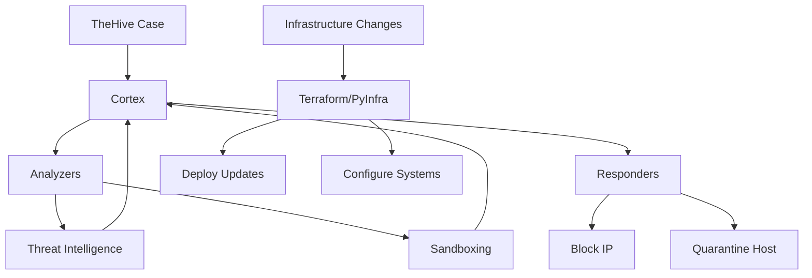
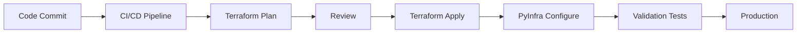

# Automation and SOAR

Automation is critical for scaling SOC operations and reducing response times. This layer combines security orchestration (Cortex SOAR) with infrastructure automation (Terraform/PyInfra) to enable rapid, consistent responses to security events and efficient infrastructure management.

<Info>
Automation reduces manual work, eliminates human error, and enables your team to focus on complex investigations while repetitive tasks are handled automatically.
</Info>

## Architecture Overview



<CardGroup cols={2}>
  <Card title="Cortex SOAR" icon="diagram-project">
    Security orchestration for investigation and response automation
  </Card>
  <Card title="Infrastructure as Code" icon="file-code">
    Terraform and PyInfra for automated infrastructure management
  </Card>
</CardGroup>

## Cortex SOAR Platform

Cortex is the automation engine that powers TheHive, providing analyzers for enrichment and responders for automated actions.

### Core Concepts

<Tabs>
  <Tab title="Analyzers">
    **Observable Enrichment:**
    
    Analyzers automatically enrich observables with contextual information:
    
    - **Threat Intelligence**: VirusTotal, MISP, OTX
    - **Reputation**: AbuseIPDB, URLhaus, PhishTank
    - **Sandboxing**: Joe Sandbox, Cuckoo, ANY.RUN
    - **DNS/WHOIS**: PassiveTotal, DomainTools
    - **File Analysis**: YARA, ClamAV, PEFile
    - **Network**: Shodan, Censys, MaxMind GeoIP
  </Tab>
  <Tab title="Responders">
    **Automated Response Actions:**
    
    Responders execute actions on observables or cases:
    
    - **Network**: Block IP on firewall, DNS sinkhole
    - **Endpoint**: Quarantine host, kill process
    - **Email**: Report phishing, block sender
    - **User**: Disable account, force password reset
    - **Notification**: Slack, email, PagerDuty, Teams
    - **Integration**: Update SIEM, create ticket
  </Tab>
  <Tab title="Jobs">
    **Execution Management:**
    
    - Jobs track analyzer/responder execution
    - View results and reports
    - Monitor success/failure rates
    - Historical job data for metrics
    - Job templates for consistency
  </Tab>
</Tabs>

### Analyzer Configuration

<Tip>
Start with free analyzers (AbuseIPDB, OTX, MISP) and gradually add commercial services (VirusTotal, PassiveTotal) based on investigation needs and budget.
</Tip>

<AccordionGroup>
  <Accordion title="Analyzer Types by Data Type">
    **IP Address Analyzers:**
    - AbuseIPDB_1: IP reputation and reports
    - GreyNoise: Internet scanner identification
    - IPVoid: Multi-engine reputation check
    - MaxMind GeoIP: Geographic location
    - Shodan: Internet exposure scanning
    - Tor Project: Tor exit node detection
    
    **File Hash Analyzers:**
    - VirusTotal: Multi-AV scanning
    - MISP: Threat intelligence correlation
    - MalwareBazaar: Known malware repository
    - HybridAnalysis: Sandbox analysis
    
    **URL/Domain Analyzers:**
    - URLhaus: Malware distribution URLs
    - PhishTank: Phishing URL database
    - Google Safe Browsing: URL safety
    - Censys: Certificate and host analysis
  </Accordion>
  <Accordion title="Analyzer Configuration Example">
    ```json
    // VirusTotal analyzer configuration
    {
      "name": "VirusTotal_GetReport_3_0",
      "version": "3.0",
      "description": "Get VirusTotal report for file, hash, domain, IP, or URL",
      "dataTypeList": ["file", "hash", "domain", "ip", "url"],
      "baseConfig": "VirusTotal",
      "config": {
        "service": "get_report"
      },
      "configurationItems": [
        {
          "name": "key",
          "description": "VirusTotal API key",
          "type": "string",
          "multi": false,
          "required": true
        },
        {
          "name": "polling_interval",
          "description": "Polling interval (seconds)",
          "type": "number",
          "multi": false,
          "required": false,
          "defaultValue": 60
        }
      ]
    }
    ```
  </Accordion>
  <Accordion title="Custom Analyzer Development">
    Create custom analyzers for internal tools:
    
    ```python
    #!/usr/bin/env python3
    from cortexutils.analyzer import Analyzer
    
    class InternalThreatIntel(Analyzer):
        def __init__(self):
            Analyzer.__init__(self)
            self.service = self.get_param('config.service', None)
            self.api_url = self.get_param('config.url', None)
            self.api_key = self.get_param('config.key', None)
        
        def summary(self, raw):
            taxonomies = []
            level = "info"
            namespace = "InternalTI"
            predicate = "Threat"
            
            if raw.get('is_malicious'):
                level = "malicious"
                value = "Known Threat"
            else:
                level = "safe"
                value = "Clean"
            
            taxonomies.append(self.build_taxonomy(
                level, namespace, predicate, value
            ))
            
            return {"taxonomies": taxonomies}
        
        def run(self):
            data = self.get_data()
            
            # Query internal threat intel database
            result = self.check_internal_ti(data)
            
            self.report(result)
        
        def check_internal_ti(self, observable):
            # Implementation to check internal systems
            return {
                'is_malicious': False,
                'last_seen': None,
                'related_incidents': []
            }
    
    if __name__ == '__main__':
        InternalThreatIntel().run()
    ```
  </Accordion>
</AccordionGroup>

### Responder Configuration

<Warning>
Responders can make destructive changes (block IPs, quarantine hosts, disable accounts). Always test in a lab environment and implement approval workflows for critical actions.
</Warning>

<Tabs>
  <Tab title="Network Responders">
    **Firewall Integration:**
    
    ```python
    #!/usr/bin/env python3
    # OPNsense firewall block IP responder
    from cortexutils.responder import Responder
    import requests
    
    class OPNsenseBlockIP(Responder):
        def __init__(self):
            Responder.__init__(self)
            self.firewall_url = self.get_param('config.url')
            self.api_key = self.get_param('config.api_key')
            self.api_secret = self.get_param('config.api_secret')
        
        def run(self):
            data = self.get_param('data', None, 'Missing data field')
            
            if data.get('dataType') == 'ip':
                ip_address = data.get('data')
                
                # Add IP to blocklist
                result = self.block_ip(ip_address)
                
                if result:
                    self.report({'message': f'Blocked {ip_address}'})
                else:
                    self.error('Failed to block IP')
            else:
                self.error('Responder works only with IP observables')
        
        def block_ip(self, ip):
            # Implementation to block IP on firewall
            endpoint = f"{self.firewall_url}/api/firewall/alias/addItem"
            
            payload = {
                'alias': 'BlockedIPs',
                'address': ip,
                'description': f'Blocked by Cortex - {self.get_param("title")}'
            }
            
            response = requests.post(
                endpoint,
                json=payload,
                auth=(self.api_key, self.api_secret),
                verify=False
            )
            
            return response.status_code == 200
    
    if __name__ == '__main__':
        OPNsenseBlockIP().run()
    ```
  </Tab>
  <Tab title="Endpoint Responders">
    **Host Quarantine:**
    
    ```python
    # Wazuh active response integration
    class WazuhQuarantineHost(Responder):
        def run(self):
            hostname = self.get_param('data.data')
            
            # Get Wazuh agent ID
            agent_id = self.get_agent_id(hostname)
            
            if agent_id:
                # Execute active response
                self.quarantine_agent(agent_id)
                self.report({'message': f'Quarantined {hostname}'})
            else:
                self.error(f'Agent not found: {hostname}')
        
        def quarantine_agent(self, agent_id):
            # Execute Wazuh active response
            # Block network, disable services, etc.
            pass
    ```
  </Tab>
  <Tab title="Notification Responders">
    **Slack Integration:**
    
    ```python
    # Send case update to Slack
    class SlackNotification(Responder):
        def run(self):
            webhook_url = self.get_param('config.webhook_url')
            
            case_title = self.get_param('data.title')
            case_severity = self.get_param('data.severity')
            
            message = {
                'text': f'Security Incident: {case_title}',
                'attachments': [{
                    'color': self.get_color(case_severity),
                    'fields': [
                        {'title': 'Severity', 'value': case_severity},
                        {'title': 'Status', 'value': self.get_param('data.status')}
                    ]
                }]
            }
            
            requests.post(webhook_url, json=message)
            self.report({'message': 'Notification sent'})
    ```
  </Tab>
</Tabs>

### Automation Workflows

Chain multiple analyzers and responders for complete automation:

<AccordionGroup>
  <Accordion title="Automated Triage Workflow">
    **Observable Added → Automatic Enrichment:**
    
    1. IP address added to case
    2. Run AbuseIPDB analyzer (reputation)
    3. Run GreyNoise analyzer (scanner detection)
    4. Run Shodan analyzer (exposure check)
    5. Run MaxMind analyzer (geolocation)
    6. If malicious score > threshold:
       - Run firewall block responder
       - Send Slack notification
       - Create blocking task
  </Accordion>
  <Accordion title="Phishing Response Workflow">
    **Email Observable → Automated Response:**
    
    1. URL extracted from phishing email
    2. Run URLhaus analyzer
    3. Run PhishTank analyzer
    4. Run VirusTotal analyzer
    5. If confirmed phishing:
       - Report to email gateway
       - Block sender domain
       - Search for similar emails
       - Notify affected users
  </Accordion>
  <Accordion title="Malware Detection Workflow">
    **File Hash → Sandbox Analysis:**
    
    1. File hash observable created
    2. Run VirusTotal analyzer
    3. If unknown or suspicious:
       - Submit to Joe Sandbox
       - Submit to Hybrid Analysis
    4. If confirmed malicious:
       - Quarantine affected hosts
       - Search for hash in environment
       - Update antivirus signatures
       - Block at proxy/firewall
  </Accordion>
</AccordionGroup>

## Infrastructure as Code (IaC)

### Terraform Automation

Terraform manages SOC infrastructure deployment and configuration:

<Tabs>
  <Tab title="Infrastructure Provisioning">
    ```hcl
    # Terraform configuration for SOC infrastructure
    terraform {
      required_providers {
        proxmox = {
          source = "telmate/proxmox"
          version = "2.9.14"
        }
      }
    }
    
    # Deploy Wazuh server
    resource "proxmox_vm_qemu" "wazuh" {
      name        = "wazuh-server"
      target_node = "proxmox-node-01"
      clone       = "ubuntu-22.04-template"
      
      cores   = 4
      memory  = 8192
      scsihw  = "virtio-scsi-pci"
      
      disk {
        size    = "100G"
        type    = "scsi"
        storage = "local-lvm"
      }
      
      network {
        model  = "virtio"
        bridge = "vmbr0"
      }
      
      # Post-deployment configuration
      provisioner "remote-exec" {
        inline = [
          "curl -sO https://packages.wazuh.com/4.x/wazuh-install.sh",
          "bash wazuh-install.sh -a"
        ]
      }
    }
    
    # Deploy Elasticsearch cluster
    resource "proxmox_vm_qemu" "elasticsearch" {
      count       = 3
      name        = "elasticsearch-${count.index + 1}"
      target_node = "proxmox-node-0${(count.index % 3) + 1}"
      
      cores  = 8
      memory = 32768
      
      # ... additional configuration
    }
    ```
  </Tab>
  <Tab title="Network Configuration">
    ```hcl
    # Firewall rules for SOC components
    resource "opnsense_firewall_rule" "allow_wazuh_agents" {
      description = "Allow Wazuh agents to manager"
      interface   = "LAN"
      protocol    = "tcp"
      source      = "any"
      destination = var.wazuh_server_ip
      port        = "1514,1515"
      action      = "pass"
    }
    
    resource "opnsense_firewall_rule" "block_suspicious_ips" {
      description = "Block IPs flagged by threat intel"
      interface   = "WAN"
      protocol    = "any"
      source      = "alias:BlockedIPs"
      destination = "any"
      action      = "block"
      log         = true
    }
    ```
  </Tab>
  <Tab title="State Management">
    ```hcl
    # Remote state backend for team collaboration
    terraform {
      backend "s3" {
        bucket         = "soc-terraform-state"
        key            = "infrastructure/terraform.tfstate"
        region         = "us-east-1"
        encrypt        = true
        dynamodb_table = "terraform-locks"
      }
    }
    
    # Outputs for other modules
    output "wazuh_server_ip" {
      value       = proxmox_vm_qemu.wazuh.default_ipv4_address
      description = "Wazuh manager IP address"
    }
    
    output "elasticsearch_cluster" {
      value = {
        for idx, vm in proxmox_vm_qemu.elasticsearch :
        idx => vm.default_ipv4_address
      }
      description = "Elasticsearch node IPs"
    }
    ```
  </Tab>
</Tabs>

### PyInfra Automation

PyInfra provides Python-based configuration management:

<Tip>
Use PyInfra for complex configuration tasks that benefit from Python's flexibility, while Terraform handles infrastructure provisioning.
</Tip>

<AccordionGroup>
  <Accordion title="System Configuration">
    ```python
    # deploy.py - Configure Wazuh agents
    from pyinfra.operations import apt, files, systemd
    
    # Install Wazuh agent
    apt.packages(
        name="Install Wazuh agent",
        packages=['wazuh-agent'],
        update=True,
    )
    
    # Configure agent
    files.template(
        name="Configure Wazuh agent",
        src="templates/ossec.conf.j2",
        dest="/var/ossec/etc/ossec.conf",
        manager_ip="{{ wazuh_manager }}",
        mode="640",
    )
    
    # Enable and start service
    systemd.service(
        name="Start Wazuh agent",
        service="wazuh-agent",
        running=True,
        enabled=True,
        restarted=True,
    )
    ```
  </Accordion>
  <Accordion title="Security Hardening">
    ```python
    # harden.py - Security baseline
    from pyinfra.operations import apt, files, server
    
    # Install security tools
    apt.packages(
        name="Install security packages",
        packages=[
            'fail2ban',
            'aide',
            'auditd',
            'ufw',
        ],
    )
    
    # Configure firewall
    server.shell(
        name="Configure UFW",
        commands=[
            'ufw default deny incoming',
            'ufw default allow outgoing',
            'ufw allow ssh',
            'ufw --force enable',
        ],
    )
    
    # Secure SSH configuration
    files.line(
        name="Disable SSH password auth",
        path="/etc/ssh/sshd_config",
        line="PasswordAuthentication no",
        replace="PasswordAuthentication yes",
    )
    ```
  </Accordion>
  <Accordion title="Deployment Automation">
    ```python
    # update_ids_rules.py - Update IDS rules across all sensors
    from pyinfra import host
    from pyinfra.operations import files, systemd
    
    # Download latest Suricata rules
    files.download(
        name="Download Suricata rules",
        src="https://rules.emergingthreats.net/open/suricata/emerging.rules.tar.gz",
        dest="/tmp/emerging.rules.tar.gz",
    )
    
    # Extract and deploy
    server.shell(
        name="Deploy rules",
        commands=[
            'tar -xzf /tmp/emerging.rules.tar.gz -C /etc/suricata/rules/',
            'suricata -T -c /etc/suricata/suricata.yaml',  # Test config
        ],
    )
    
    # Reload Suricata
    systemd.service(
        name="Reload Suricata",
        service="suricata",
        reloaded=True,
    )
    ```
  </Accordion>
</AccordionGroup>

## Integration Patterns

### Automated Incident Response

<CardGroup cols={2}>
  <Card title="Detection" icon="radar">
    IDS/SIEM detects threat → Creates alert
  </Card>
  <Card title="Enrichment" icon="magnifying-glass">
    Cortex analyzers gather intelligence
  </Card>
  <Card title="Decision" icon="brain">
    Automated scoring determines severity
  </Card>
  <Card title="Response" icon="shield">
    Cortex responders execute containment
  </Card>
</CardGroup>

### Continuous Deployment



## Best Practices

<AccordionGroup>
  <Accordion title="SOAR Automation">
    - **Start conservative**: Begin with analyzers only, add responders gradually
    - **Test thoroughly**: Validate in lab before production deployment
    - **Implement approvals**: Require human approval for destructive actions
    - **Monitor job failures**: Alert on analyzer/responder errors
    - **Document workflows**: Maintain runbooks for automated procedures
    - **Rate limiting**: Prevent API quota exhaustion
  </Accordion>
  <Accordion title="Infrastructure as Code">
    - **Version control**: Store all Terraform/PyInfra code in Git
    - **Code review**: Require peer review for infrastructure changes
    - **State management**: Use remote backends with locking
    - **Secrets management**: Never commit credentials, use vaults
    - **Modular design**: Create reusable modules and roles
    - **Testing**: Validate configurations before applying
  </Accordion>
  <Accordion title="Security">
    - **Least privilege**: Grant minimum necessary permissions
    - **Audit logging**: Log all automated actions
    - **Credential rotation**: Regularly update API keys and passwords
    - **Network segmentation**: Isolate automation systems
    - **Change management**: Follow approval processes for automation changes
  </Accordion>
</AccordionGroup>

## Metrics and Monitoring

<Tabs>
  <Tab title="SOAR Metrics">
    **Track automation effectiveness:**
    
    - Analyzer success/failure rates
    - Average enrichment time
    - Responder execution success
    - API quota utilization
    - Time saved through automation
    - Manual intervention frequency
  </Tab>
  <Tab title="IaC Metrics">
    **Monitor infrastructure automation:**
    
    - Deployment success rates
    - Configuration drift detection
    - Time to provision resources
    - Infrastructure cost tracking
    - Change frequency
    - Rollback incidents
  </Tab>
</Tabs>

## Official Documentation

<CardGroup cols={2}>
  <Card title="Cortex Documentation" icon="book" href="https://github.com/TheHive-Project/Cortex">
    Official Cortex documentation and analyzer catalog
  </Card>
  <Card title="Terraform Docs" icon="book" href="https://www.terraform.io/docs">
    Complete Terraform documentation and provider registry
  </Card>
  <Card title="PyInfra Documentation" icon="book" href="https://docs.pyinfra.com/">
    PyInfra operations reference and examples
  </Card>
  <Card title="Cortex Analyzers" icon="puzzle-piece" href="https://github.com/TheHive-Project/Cortex-Analyzers">
    Open-source analyzer and responder repository
  </Card>
</CardGroup>

## Next Steps

1. Review [Operations Guide](/operations/monitoring-guide) for automation best practices
2. Explore [Incident Handling](/operations/incident-handling) playbooks for automation opportunities
3. Check [Threat Detection](/security/threat-detection) strategies for automated enrichment workflows