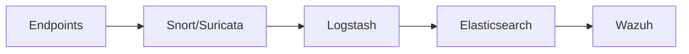

# Detection Layer (IDS/IPS)

The detection layer forms the first line of defense in the SOC architecture, providing real-time network traffic analysis and threat detection capabilities through industry-leading IDS/IPS solutions.

<Info>
Both Snort and Suricata monitor network traffic from endpoints to identify potential security threats using signature-based and behavioral detection methods.
</Info>

## Components Overview

<CardGroup cols={2}>
  <Card title="Snort" icon="shield-halved" href="https://www.snort.org/documents">
    Rule-based intrusion detection system with extensive community support
  </Card>
  <Card title="Suricata" icon="shield-check" href="https://suricata.readthedocs.io/">
    High-performance IDS/IPS with multi-threading and advanced detection
  </Card>
</CardGroup>

## Snort IDS

### Capabilities

Snort is a proven, rule-based intrusion detection system that provides:

- **Real-time traffic analysis**: Monitors network packets as they traverse the network
- **Protocol analysis**: Deep inspection of network protocols to identify anomalies
- **Content matching**: Signature-based detection using extensive rule sets
- **Logging and alerting**: Captures and reports suspicious activity

<Tip>
Snort's extensive community maintains one of the largest threat signature databases, with daily rule updates available through Snort Talos.
</Tip>

### Rule Management

<Tabs>
  <Tab title="Rule Sources">
    - **Community Rules**: Free, community-maintained signatures
    - **Snort Talos**: Commercial ruleset with rapid threat coverage
    - **Custom Rules**: Organization-specific detection patterns
  </Tab>
  <Tab title="Rule Updates">
    Rules should be updated regularly to maintain detection effectiveness:
    ```bash
    # Update Snort rules
    pulledpork.pl -c /etc/snort/pulledpork.conf
    snort -T -c /etc/snort/snort.conf
    ```
  </Tab>
  <Tab title="Performance">
    - Optimize rule processing with flowbits
    - Use rule suppressions for false positives
    - Enable rule profiling to identify slow rules
  </Tab>
</Tabs>

## Suricata IPS

### Advanced Capabilities

Suricata offers next-generation intrusion prevention with:

- **Multi-threading**: Utilizes multiple CPU cores for high-performance inspection
- **Protocol detection**: Automatic protocol detection regardless of port
- **File extraction**: Capture files from network streams for analysis
- **TLS inspection**: Decrypt and inspect encrypted traffic (with proper certificates)
- **Lua scripting**: Extend detection with custom Lua scripts

<Note>
Suricata can process network traffic at multi-gigabit speeds while performing deep packet inspection and running thousands of detection rules simultaneously.
</Note>

### Detection Methods

<AccordionGroup>
  <Accordion title="Signature-based Detection">
    Traditional rule-based detection using pattern matching:
    - Known attack signatures
    - CVE-specific patterns
    - Malware indicators
  </Accordion>
  <Accordion title="Protocol Anomaly Detection">
    Identifies deviations from normal protocol behavior:
    - Malformed packets
    - Protocol violations
    - Unusual traffic patterns
  </Accordion>
  <Accordion title="Behavioral Analysis">
    Detects suspicious activities based on behavior:
    - Command and control (C2) communication
    - Data exfiltration patterns
    - Lateral movement attempts
  </Accordion>
</AccordionGroup>

## Integration with SOC Architecture

### Data Flow

The detection layer integrates seamlessly into the broader SOC ecosystem:



1. **Endpoints** generate network traffic
2. **Snort/Suricata** analyze traffic in real-time
3. **Logstash** aggregates and processes alerts
4. **Elasticsearch** stores events for analysis
5. **Wazuh** correlates events and provides visualization

### Event Forwarding

<Tabs>
  <Tab title="Syslog">
    Forward alerts via syslog to centralized logging:
    ```yaml
    # Suricata eve.json output
    - eve-log:
        enabled: yes
        filetype: syslog
        types:
          - alert
          - http
          - dns
          - tls
    ```
  </Tab>
  <Tab title="JSON">
    Output structured JSON for easier parsing:
    ```yaml
    # JSON output configuration
    - eve-log:
        enabled: yes
        filetype: regular
        filename: eve.json
        types:
          - alert
          - anomaly
          - flow
    ```
  </Tab>
  <Tab title="File Extraction">
    Extract suspicious files for analysis:
    ```yaml
    - file-store:
        version: 2
        enabled: yes
        dir: /var/log/suricata/files
        force-filestore: yes
    ```
  </Tab>
</Tabs>

## Configuration Considerations

<Warning>
Proper network placement is critical. IDS/IPS sensors should be deployed at strategic points:
- **Inline mode** (IPS): Blocks malicious traffic in real-time but requires careful tuning
- **Passive mode** (IDS): Monitors traffic without blocking, safer for initial deployment
</Warning>

### Network Placement

- **Perimeter**: Monitor traffic entering/exiting the network
- **Internal segments**: Detect lateral movement between network zones
- **Critical assets**: Protect high-value targets with dedicated sensors

### Performance Tuning

<Accordion title="Hardware Requirements">
  - **CPU**: Multi-core processors (8+ cores recommended for Suricata)
  - **Memory**: Minimum 8GB RAM, 16GB+ for high-traffic environments
  - **Network**: Dedicated NICs for traffic capture
  - **Storage**: Fast SSD for rule processing and logging
</Accordion>

<Accordion title="Optimization Tips">
  - Enable hardware offloading (RSS, checksum offloading)
  - Tune packet acquisition (AF_PACKET, PF_RING)
  - Adjust rule thresholds and suppression
  - Use BPF filters to reduce traffic volume
  - Monitor drop rates and optimize buffer sizes
</Accordion>

## Rule Development

### Custom Detection Rules

Create organization-specific detection rules:

```bash
# Snort/Suricata rule example
alert http any any -> $HOME_NET any (
    msg:"Potential data exfiltration detected";
    flow:established,to_server;
    content:"POST";
    http_method;
    content:"password"; nocase;
    http_client_body;
    classtype:policy-violation;
    sid:1000001;
    rev:1;
)
```

<Tip>
Test custom rules in a lab environment before deploying to production. Use rule performance profiling to ensure they don't impact system performance.
</Tip>

## Monitoring and Maintenance

### Health Checks

Regularly monitor sensor health:

- **Packet drop rate**: Should be < 1%
- **CPU utilization**: Keep below 80% average
- **Memory usage**: Monitor for memory leaks
- **Rule reload time**: Should complete within seconds

### Alerting

<CardGroup cols={2}>
  <Card title="High Priority" icon="triangle-exclamation">
    - Sensor failures
    - Packet drops > 5%
    - Rule reload failures
  </Card>
  <Card title="Medium Priority" icon="circle-info">
    - High CPU/memory usage
    - Outdated rule sets
    - Disk space warnings
  </Card>
</CardGroup>

## Best Practices

1. **Regular Updates**: Keep rule sets current with latest threat intelligence
2. **Baseline Traffic**: Understand normal network patterns to reduce false positives
3. **Staged Deployment**: Test new rules in monitoring mode before enabling blocking
4. **Performance Monitoring**: Track sensor performance metrics continuously
5. **Alert Tuning**: Regularly review and tune alerts to minimize noise

## Official Documentation

<CardGroup cols={2}>
  <Card title="Snort Documentation" icon="book" href="https://www.snort.org/documents">
    Official Snort user guides and manuals
  </Card>
  <Card title="Suricata User Guide" icon="book" href="https://suricata.readthedocs.io/">
    Comprehensive Suricata documentation
  </Card>
  <Card title="Emerging Threats" icon="shield" href="https://rules.emergingthreats.net/">
    Free and commercial rule sets
  </Card>
  <Card title="Snort Talos" icon="shield-check" href="https://www.snort.org/talos">
    Cisco Talos threat intelligence
  </Card>
</CardGroup>

## Next Steps

After deploying the detection layer:

1. Configure [Log Aggregation](/components/log-aggregation) to collect IDS/IPS alerts
2. Set up [SIEM Platform](/components/siem-platform) for event correlation
3. Establish [Incident Response](/components/incident-response) workflows for detected threats