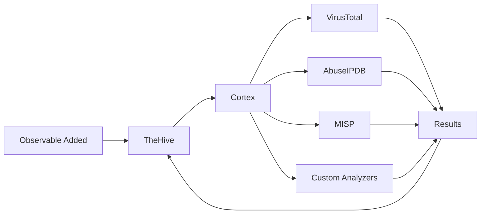

# Incident Response Platform - TheHive

TheHive is a scalable, open-source Security Incident Response Platform (SIRP) designed to help SOC teams manage, investigate, and respond to security incidents efficiently through structured case management and collaborative workflows.

<Info>
TheHive enables security teams to transform alerts into actionable cases, collaborate on investigations, and track incidents from detection through resolution with full audit trails.
</Info>

## Platform Overview

<CardGroup cols={2}>
  <Card title="Case Management" icon="folder-open">
    Structured incident tracking with customizable workflows
  </Card>
  <Card title="Collaboration" icon="users">
    Multi-user environment with role-based access control
  </Card>
  <Card title="Task Management" icon="list-check">
    Assign and track investigation tasks across team members
  </Card>
  <Card title="Observable Analysis" icon="magnifying-glass">
    Automated enrichment and analysis of IOCs
  </Card>
</CardGroup>

## Core Capabilities

### Case Management

Organize security incidents with comprehensive case tracking:

<Tabs>
  <Tab title="Case Structure">
    **Components of a Case:**
    
    - **Basic Information**:
      - Title and description
      - Severity level (Low, Medium, High, Critical)
      - TLP (Traffic Light Protocol) classification
      - PAP (Permissible Actions Protocol)
    
    - **Metadata**:
      - Tags for categorization
      - Custom fields
      - Timestamps (creation, update, closure)
      - Assigned analysts
    
    - **Relationships**:
      - Linked cases
      - Related alerts
      - Parent/child case hierarchy
  </Tab>
  <Tab title="Case Workflow">
    **Typical Investigation Flow:**
    
    1. **Alert Creation**: Automatic from SIEM/IDS
    2. **Triage**: Review and promote to case
    3. **Investigation**: Analyze observables, add tasks
    4. **Response**: Execute containment actions
    5. **Resolution**: Document findings, close case
    6. **Post-Mortem**: Extract lessons learned
  </Tab>
  <Tab title="Custom Templates">
    **Case Templates:**
    
    Pre-configured templates for common scenarios:
    - Malware infection
    - Phishing campaign
    - Data breach
    - Account compromise
    - DDoS attack
    - Insider threat
    
    Each template includes:
    - Standard tasks checklist
    - Required observables
    - Custom field definitions
  </Tab>
</Tabs>

<Tip>
Use case templates to standardize investigation procedures and ensure consistent response across your team. Templates reduce response time and prevent missed steps.
</Tip>

### Task Management

Break down investigations into manageable tasks:

<AccordionGroup>
  <Accordion title="Task Types">
    **Common Investigation Tasks:**
    
    - **Containment**: Isolate affected systems
    - **Analysis**: Examine logs, network traffic, files
    - **Intelligence**: Check threat intelligence sources
    - **Communication**: Notify stakeholders
    - **Documentation**: Record findings and actions
    - **Remediation**: Apply fixes and patches
  </Accordion>
  <Accordion title="Task Assignment">
    **Collaboration Features:**
    
    - Assign tasks to specific analysts
    - Set due dates and priorities
    - Track task status (Waiting, InProgress, Completed, Cancel)
    - Add task logs for progress updates
    - Attach files and screenshots
    - Link observables to tasks
  </Accordion>
  <Accordion title="Task Automation">
    **Automated Task Creation:**
    
    ```python
    # Create tasks automatically when case is created
    tasks = [
        {
            'title': 'Initial Triage',
            'description': 'Review alert and determine severity',
            'owner': 'tier1-team'
        },
        {
            'title': 'Collect Evidence',
            'description': 'Gather relevant logs and artifacts',
            'owner': 'assigned-analyst'
        },
        {
            'title': 'Analyze Malware',
            'description': 'Submit samples to sandbox',
            'owner': 'malware-analyst'
        }
    ]
    ```
  </Accordion>
</AccordionGroup>

### Observables and IOCs

Track and analyze indicators of compromise:

<Warning>
Observables marked with TLP:RED should never be shared outside your organization. Always respect TLP classifications when exporting or sharing case data.
</Warning>

**Supported Observable Types:**

<CardGroup cols={3}>
  <Card title="Network" icon="network-wired">
    - IP addresses
    - Domain names
    - URLs
    - Email addresses
  </Card>
  <Card title="Files" icon="file">
    - File hashes (MD5, SHA1, SHA256)
    - File names
    - File paths
    - Registry keys
  </Card>
  <Card title="Other" icon="fingerprint">
    - User accounts
    - Autonomous Systems
    - Bitcoin addresses
    - Custom types
  </Card>
</CardGroup>

### Observable Enrichment

Integration with Cortex analyzers provides automatic enrichment:



<Tabs>
  <Tab title="Threat Intelligence">
    **Intelligence Lookups:**
    
    - **VirusTotal**: File and URL reputation
    - **AbuseIPDB**: IP address reputation
    - **MISP**: Threat intelligence platform
    - **OTX AlienVault**: Open threat exchange
    - **Shodan**: Internet device search
  </Tab>
  <Tab title="Technical Analysis">
    **Deep Analysis:**
    
    - **Joe Sandbox**: Malware analysis
    - **Cuckoo Sandbox**: Automated malware analysis
    - **YARA**: Pattern matching
    - **MaxMind**: Geolocation
    - **PassiveTotal**: DNS/WHOIS history
  </Tab>
  <Tab title="Custom Analyzers">
    **Internal Tools:**
    
    - Query internal threat intel
    - Check against allowlists
    - Validate against asset database
    - Cross-reference with previous incidents
  </Tab>
</Tabs>

## Integration with SOC Architecture

### Alert Import from Wazuh

Automatic case creation from SIEM alerts:

<Accordion title="Wazuh to TheHive Integration">
```python
#!/usr/bin/env python3
# Wazuh integration script for TheHive

import json
import sys
from thehive4py.api import TheHiveApi
from thehive4py.models import Alert, AlertArtifact

# TheHive configuration
thehive_url = 'http://thehive:9000'
thehive_api_key = 'YOUR_API_KEY'
api = TheHiveApi(thehive_url, thehive_api_key)

# Read Wazuh alert
alert_file = sys.argv[1]
with open(alert_file) as f:
    wazuh_alert = json.load(f)

# Map severity
severity_map = {
    'low': 1,
    'medium': 2,
    'high': 3,
    'critical': 4
}

# Extract observables
artifacts = []

if 'data' in wazuh_alert and 'srcip' in wazuh_alert['data']:
    artifacts.append(AlertArtifact(
        dataType='ip',
        data=wazuh_alert['data']['srcip'],
        tags=['wazuh', 'source']
    ))

if 'data' in wazuh_alert and 'dstip' in wazuh_alert['data']:
    artifacts.append(AlertArtifact(
        dataType='ip',
        data=wazuh_alert['data']['dstip'],
        tags=['wazuh', 'destination']
    ))

# Create alert in TheHive
thehive_alert = Alert(
    title=wazuh_alert['rule']['description'],
    tlp=2,  # TLP:AMBER
    severity=severity_map.get(wazuh_alert.get('rule', {}).get('level', 'medium'), 2),
    description=f"Wazuh Alert: {wazuh_alert['rule']['description']}",
    type='wazuh',
    source='Wazuh',
    sourceRef=wazuh_alert['id'],
    artifacts=artifacts,
    tags=['wazuh', f"rule-{wazuh_alert['rule']['id']}"]
)

# Send to TheHive
response = api.create_alert(thehive_alert)
print(f"Alert created: {response.json()['id']}")
```
</Accordion>

### Data Flow

1. **Detection**: Wazuh/IDS generates security alert
2. **Import**: Alert automatically created in TheHive
3. **Triage**: Analyst reviews and promotes to case
4. **Investigation**: Observables analyzed via Cortex
5. **Response**: Actions executed via SOAR integration
6. **Closure**: Case documented and archived

## Collaboration Features

### Multi-Analyst Workflows

<CardGroup cols={2}>
  <Card title="Real-time Updates" icon="arrows-rotate">
    Live case updates visible to all team members
  </Card>
  <Card title="Comments & Logs" icon="comments">
    Discussion threads and activity logs
  </Card>
  <Card title="File Attachments" icon="paperclip">
    Share evidence, screenshots, and reports
  </Card>
  <Card title="Notifications" icon="bell">
    Alert assignments and case updates
  </Card>
</CardGroup>

### Role-Based Access Control

<Tabs>
  <Tab title="User Roles">
    **Default Roles:**
    
    - **Admin**: Full system administration
    - **Org-admin**: Organizational management
    - **Analyst**: Create and manage cases
    - **Read-only**: View cases and alerts
  </Tab>
  <Tab title="Permissions">
    **Granular Controls:**
    
    - Case creation and modification
    - Observable analysis
    - Task assignment
    - User management
    - Export capabilities
    - API access
  </Tab>
  <Tab title="Organizations">
    **Multi-Tenancy:**
    
    - Separate organizations for different teams
    - Shared or isolated case visibility
    - Cross-organization collaboration
    - Organization-specific templates
  </Tab>
</Tabs>

## Reporting and Metrics

### Dashboard Analytics

<Tip>
Regularly review metrics to identify trends, measure team performance, and justify resource allocation for your SOC.
</Tip>

<AccordionGroup>
  <Accordion title="Operational Metrics">
    **Key Performance Indicators:**
    
    - Cases opened/closed over time
    - Mean time to detect (MTTD)
    - Mean time to respond (MTTR)
    - Mean time to resolve (MTTR)
    - Alert-to-case conversion rate
    - Cases by severity distribution
  </Accordion>
  <Accordion title="Analyst Performance">
    **Team Metrics:**
    
    - Cases handled per analyst
    - Average resolution time
    - Task completion rates
    - Workload distribution
    - Escalation frequency
  </Accordion>
  <Accordion title="Threat Metrics">
    **Security Insights:**
    
    - Top attack types
    - Most targeted assets
    - Threat actor campaigns
    - IOC recurrence
    - Geographic threat sources
  </Accordion>
</AccordionGroup>

### Report Generation

```python
# Export case report
from thehive4py.api import TheHiveApi
from thehive4py.query import *

api = TheHiveApi('http://thehive:9000', 'API_KEY')

# Query cases
query = And(
    Gte('startDate', 1609459200000),  # Jan 1, 2021
    Lt('startDate', 1640995200000),    # Jan 1, 2022
    Eq('status', 'Resolved')
)

cases = api.find_cases(query=query, range='all', sort='-startDate')

# Generate report
for case in cases.json():
    print(f"Case: {case['title']}")
    print(f"Severity: {case['severity']}")
    print(f"Status: {case['status']}")
    print(f"Tasks: {case['stats']['tasks']}")
    print("---")
```

## Best Practices

<AccordionGroup>
  <Accordion title="Case Management">
    - **Standardize naming**: Use consistent case titles
    - **Tag appropriately**: Enable searching and grouping
    - **Document thoroughly**: Future analysts will thank you
    - **Link related cases**: Track campaign-based attacks
    - **Set accurate TLP**: Protect sensitive information
  </Accordion>
  <Accordion title="Investigation Process">
    - **Follow runbooks**: Use templates and checklists
    - **Preserve evidence**: Maintain chain of custody
    - **Enrich observables**: Run all relevant analyzers
    - **Track time**: Log hours for metrics and billing
    - **Communicate status**: Keep stakeholders informed
  </Accordion>
  <Accordion title="Team Collaboration">
    - **Update case logs**: Document progress regularly
    - **Assign tasks clearly**: Define ownership and deadlines
    - **Share knowledge**: Use case comments for insights
    - **Review closed cases**: Learn from past incidents
    - **Maintain templates**: Keep playbooks current
  </Accordion>
  <Accordion title="Integration">
    - **Automate alert import**: Reduce manual work
    - **Configure webhooks**: Enable real-time notifications
    - **Use API extensively**: Integrate with other tools
    - **Regular backups**: Protect case data
    - **Monitor performance**: Track API usage and errors
  </Accordion>
</AccordionGroup>

## Advanced Features

### Custom Fields

Extend cases with organization-specific data:

```json
// Custom field definitions
{
  "fields": [
    {
      "name": "affectedAssets",
      "type": "string",
      "description": "Comma-separated list of affected systems"
    },
    {
      "name": "businessImpact",
      "type": "string",
      "description": "Description of business impact",
      "options": ["None", "Low", "Medium", "High", "Critical"]
    },
    {
      "name": "rootCause",
      "type": "text",
      "description": "Identified root cause of incident"
    }
  ]
}
```

### API Integration

<Card title="TheHive API Documentation" icon="code" href="https://docs.thehive-project.org/thehive/api-docs/">
  Complete API reference for automation and integration
</Card>

Common API operations:

```bash
# Create a new case
curl -X POST http://thehive:9000/api/case \
  -H "Authorization: Bearer API_KEY" \
  -H "Content-Type: application/json" \
  -d '{
    "title": "Malware Detection on Workstation-042",
    "description": "AV detected ransomware execution",
    "severity": 3,
    "tlp": 2,
    "tags": ["malware", "ransomware"]
  }'

# Search cases
curl -X POST http://thehive:9000/api/case/_search \
  -H "Authorization: Bearer API_KEY" \
  -H "Content-Type: application/json" \
  -d '{"query": {"_field": "status", "_value": "Open"}}'

# Add observable to case
curl -X POST http://thehive:9000/api/case/CASE_ID/artifact \
  -H "Authorization: Bearer API_KEY" \
  -H "Content-Type: application/json" \
  -d '{
    "dataType": "ip",
    "data": "192.168.1.100",
    "tags": ["malicious", "c2-server"]
  }'
```

## Official Documentation

<CardGroup cols={2}>
  <Card title="TheHive Project" icon="book" href="https://thehive-project.org/">
    Official project website and documentation
  </Card>
  <Card title="TheHive Documentation" icon="book-open" href="https://docs.thehive-project.org/">
    Complete installation and user guides
  </Card>
  <Card title="TheHive4py" icon="code" href="https://github.com/TheHive-Project/TheHive4py">
    Python library for API integration
  </Card>
  <Card title="Community" icon="users" href="https://chat.thehive-project.org/">
    Community chat for support and discussions
  </Card>
</CardGroup>

## Next Steps

1. Configure [Automation and SOAR](/components/automation-soar) with Cortex for automated response
2. Review [Incident Handling](/operations/incident-handling) procedures and playbooks
3. Set up [SIEM Platform](/components/siem-platform) integration for alert import