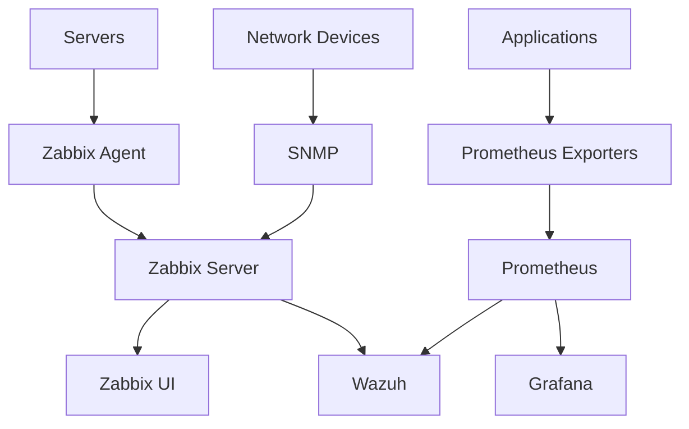

# Infrastructure Monitoring

Infrastructure monitoring provides visibility into the health, performance, and availability of all systems within the SOC environment. This layer uses industry-leading tools to ensure operational reliability and detect performance-based security anomalies.

<Info>
Zabbix and Prometheus work together to provide comprehensive monitoring: Zabbix for traditional infrastructure monitoring and Prometheus for cloud-native metrics and alerting.
</Info>

## Architecture Overview



<CardGroup cols={2}>
  <Card title="Zabbix" icon="chart-line">
    Enterprise infrastructure monitoring for availability and performance
  </Card>
  <Card title="Prometheus" icon="fire">
    Time-series metrics collection and alerting for modern infrastructure
  </Card>
</CardGroup>

## Zabbix Monitoring Platform

### Core Capabilities

Zabbix provides comprehensive monitoring for enterprise infrastructure:

<Tabs>
  <Tab title="Monitoring Methods">
    **Data Collection Techniques:**
    
    - **Agent-based**: Zabbix agents on monitored hosts
    - **Agentless**: SNMP, IPMI, JMX monitoring
    - **Active vs Passive**: Agent or server-initiated checks
    - **Web monitoring**: HTTP/HTTPS endpoint checks
    - **Database monitoring**: Native database queries
    - **Log file monitoring**: Pattern matching in logs
  </Tab>
  <Tab title="Supported Platforms">
    **Operating Systems:**
    - Linux (all major distributions)
    - Windows (Server and Desktop)
    - macOS
    - BSD variants
    - AIX, Solaris, HP-UX
    
    **Infrastructure:**
    - Network devices (SNMP)
    - VMware/Hyper-V
    - Cloud platforms (AWS, Azure, GCP)
    - Containers (Docker, Kubernetes)
  </Tab>
  <Tab title="Key Features">
    **Advanced Monitoring:**
    - Auto-discovery of devices
    - Network topology mapping
    - Distributed monitoring
    - Predictive analytics
    - SLA monitoring
    - Custom dashboards and maps
  </Tab>
</Tabs>

### Monitoring Templates

<Tip>
Zabbix includes 500+ pre-built templates for common systems and applications. Always start with official templates and customize as needed.
</Tip>

<AccordionGroup>
  <Accordion title="Operating System Templates">
    **Linux Monitoring:**
    - CPU utilization and load average
    - Memory usage (used, free, cached)
    - Disk space and I/O metrics
    - Network interface statistics
    - Process monitoring
    - System logs
    
    **Windows Monitoring:**
    - Performance counters
    - Windows services
    - Event log monitoring
    - Active Directory health
    - IIS web server metrics
  </Accordion>
  <Accordion title="Network Device Templates">
    **SNMP Monitoring:**
    - Interface status and bandwidth
    - CPU and memory on network devices
    - Routing table monitoring
    - Temperature sensors
    - Power supply status
    - Fan speed monitoring
  </Accordion>
  <Accordion title="Application Templates">
    **Common Applications:**
    - Apache/Nginx web servers
    - MySQL/PostgreSQL databases
    - Elasticsearch clusters
    - Docker containers
    - Kubernetes clusters
    - Redis, MongoDB, RabbitMQ
  </Accordion>
</AccordionGroup>

### Alert Configuration

<Warning>
Properly configured triggers prevent alert fatigue. Use appropriate thresholds, dependencies, and severity levels to ensure actionable alerts.
</Warning>

```javascript
// Example: High CPU usage trigger
Trigger: {avg(/Linux/system.cpu.util,5m)}>80
Severity: Warning
Expression: Average CPU > 80% for 5 minutes

// Critical CPU with dependency
Trigger: {avg(/Linux/system.cpu.util,5m)}>95
Severity: High
Dependency: Host is available (prevents false alerts)

// Disk space prediction
Trigger: {timeleft(/Linux/vfs.fs.size[/,pfree],1h,0)}<24h
Severity: Warning
Expression: Disk will be full in less than 24 hours
```

### Zabbix Agent Configuration

<Tabs>
  <Tab title="Linux Agent">
    ```bash
    # Install Zabbix agent
    apt-get install zabbix-agent  # Debian/Ubuntu
    yum install zabbix-agent      # RHEL/CentOS
    
    # Configure agent
    cat > /etc/zabbix/zabbix_agentd.conf <<EOF
    Server=zabbix-server.local
    ServerActive=zabbix-server.local
    Hostname=$(hostname -f)
    EnableRemoteCommands=0
    LogFile=/var/log/zabbix/zabbix_agentd.log
    
    # User parameters for custom metrics
    UserParameter=custom.metric,/usr/local/bin/check_metric.sh
    EOF
    
    # Start agent
    systemctl enable zabbix-agent
    systemctl start zabbix-agent
    ```
  </Tab>
  <Tab title="Windows Agent">
    ```powershell
    # Download and install Zabbix agent
    # Configure C:\Program Files\Zabbix Agent\zabbix_agentd.conf
    
    Server=zabbix-server.local
    ServerActive=zabbix-server.local
    Hostname=%COMPUTERNAME%
    
    # Windows-specific parameters
    PerfCounter = \Processor(_Total)\% Processor Time,60
    PerfCounter = \Memory\Available MBytes,60
    
    # Start service
    Start-Service "Zabbix Agent"
    Set-Service "Zabbix Agent" -StartupType Automatic
    ```
  </Tab>
  <Tab title="Custom Metrics">
    ```bash
    # Create custom check script
    cat > /usr/local/bin/check_failed_logins.sh <<'EOF'
    #!/bin/bash
    grep "Failed password" /var/log/auth.log | \
      grep -c "$(date '+%b %e')"
    EOF
    
    chmod +x /usr/local/bin/check_failed_logins.sh
    
    # Add to agent config
    UserParameter=security.failed.logins,/usr/local/bin/check_failed_logins.sh
    
    # Test from server
    zabbix_get -s target-host -k security.failed.logins
    ```
  </Tab>
</Tabs>

## Prometheus Metrics System

### Architecture and Concepts

Prometheus follows a pull-based model for metrics collection:

<CardGroup cols={2}>
  <Card title="Time-Series Database" icon="database">
    Efficient storage of metrics with labels for multi-dimensional data
  </Card>
  <Card title="PromQL Query Language" icon="code">
    Powerful query language for data aggregation and analysis
  </Card>
  <Card title="Service Discovery" icon="radar">
    Automatic target discovery for dynamic environments
  </Card>
  <Card title="Alertmanager" icon="bell">
    Flexible alert routing and notification management
  </Card>
</CardGroup>

### Exporters

Exporters expose metrics in Prometheus format:

<Tabs>
  <Tab title="Official Exporters">
    **System and Infrastructure:**
    - **Node Exporter**: Linux/Unix system metrics
    - **Windows Exporter**: Windows system metrics
    - **Blackbox Exporter**: Endpoint probing (HTTP, DNS, TCP)
    - **SNMP Exporter**: Network device metrics
    
    **Applications:**
    - **MySQL Exporter**: Database metrics
    - **PostgreSQL Exporter**: Database performance
    - **Redis Exporter**: Redis statistics
    - **Elasticsearch Exporter**: Cluster health
  </Tab>
  <Tab title="Installation Example">
    ```bash
    # Install Node Exporter
    wget https://github.com/prometheus/node_exporter/releases/download/v*/node_exporter-*.linux-amd64.tar.gz
    tar xvf node_exporter-*.tar.gz
    sudo mv node_exporter-*/node_exporter /usr/local/bin/
    
    # Create systemd service
    cat > /etc/systemd/system/node_exporter.service <<EOF
    [Unit]
    Description=Node Exporter
    After=network.target
    
    [Service]
    Type=simple
    ExecStart=/usr/local/bin/node_exporter
    
    [Install]
    WantedBy=multi-user.target
    EOF
    
    # Start service
    systemctl daemon-reload
    systemctl enable node_exporter
    systemctl start node_exporter
    
    # Metrics available at http://localhost:9100/metrics
    ```
  </Tab>
  <Tab title="Custom Exporters">
    ```python
    # Python custom exporter example
    from prometheus_client import start_http_server, Gauge
    import time
    
    # Define metrics
    security_events = Gauge('security_events_total', 
                            'Total security events',
                            ['severity'])
    
    def collect_metrics():
        # Your logic to collect metrics
        security_events.labels(severity='high').set(42)
        security_events.labels(severity='medium').set(156)
    
    if __name__ == '__main__':
        start_http_server(8000)
        while True:
            collect_metrics()
            time.sleep(15)
    ```
  </Tab>
</Tabs>

### Prometheus Configuration

<Accordion title="prometheus.yml Configuration">
```yaml
global:
  scrape_interval: 15s
  evaluation_interval: 15s
  external_labels:
    cluster: 'soc-production'
    environment: 'prod'

# Alertmanager configuration
alerting:
  alertmanagers:
    - static_configs:
        - targets:
            - alertmanager:9093

# Rule files
rule_files:
  - '/etc/prometheus/rules/*.yml'

# Scrape configurations
scrape_configs:
  # Prometheus itself
  - job_name: 'prometheus'
    static_configs:
      - targets: ['localhost:9090']
  
  # Node exporters
  - job_name: 'node'
    static_configs:
      - targets:
          - 'server1:9100'
          - 'server2:9100'
          - 'server3:9100'
        labels:
          group: 'production'
  
  # Blackbox exporter for endpoint monitoring
  - job_name: 'blackbox'
    metrics_path: /probe
    params:
      module: [http_2xx]
    static_configs:
      - targets:
          - https://wazuh.local
          - https://elasticsearch.local
    relabel_configs:
      - source_labels: [__address__]
        target_label: __param_target
      - source_labels: [__param_target]
        target_label: instance
      - target_label: __address__
        replacement: blackbox-exporter:9115
  
  # Service discovery for Kubernetes
  - job_name: 'kubernetes-pods'
    kubernetes_sd_configs:
      - role: pod
    relabel_configs:
      - source_labels: [__meta_kubernetes_pod_annotation_prometheus_io_scrape]
        action: keep
        regex: true
```
</Accordion>

### PromQL Queries

<Tip>
PromQL enables powerful metric aggregation across dimensions. Learn the basics of rate(), increase(), and aggregation operators for effective monitoring.
</Tip>

```promql
# CPU usage percentage
100 - (avg by (instance) (irate(node_cpu_seconds_total{mode="idle"}[5m])) * 100)

# Memory usage percentage
(1 - (node_memory_MemAvailable_bytes / node_memory_MemTotal_bytes)) * 100

# Network traffic rate (bytes per second)
irate(node_network_receive_bytes_total[5m])

# HTTP request rate per minute
rate(http_requests_total[1m]) * 60

# 95th percentile response time
histogram_quantile(0.95, rate(http_request_duration_seconds_bucket[5m]))

# Disk space remaining (hours)
predict_linear(node_filesystem_avail_bytes[1h], 3600)
```

### Alert Rules

<Accordion title="Alert Rule Examples">
```yaml
# /etc/prometheus/rules/alerts.yml
groups:
  - name: infrastructure
    interval: 30s
    rules:
      # High CPU usage
      - alert: HighCPUUsage
        expr: 100 - (avg by(instance) (irate(node_cpu_seconds_total{mode="idle"}[5m])) * 100) > 80
        for: 5m
        labels:
          severity: warning
        annotations:
          summary: "High CPU usage on {{ $labels.instance }}"
          description: "CPU usage is {{ $value }}% for 5 minutes"
      
      # Low disk space
      - alert: LowDiskSpace
        expr: (node_filesystem_avail_bytes / node_filesystem_size_bytes) * 100 < 10
        for: 5m
        labels:
          severity: critical
        annotations:
          summary: "Low disk space on {{ $labels.instance }}"
          description: "Only {{ $value }}% disk space remaining"
      
      # Service down
      - alert: ServiceDown
        expr: up == 0
        for: 1m
        labels:
          severity: critical
        annotations:
          summary: "Service {{ $labels.job }} is down"
          description: "{{ $labels.instance }} has been down for 1 minute"
      
      # High error rate
      - alert: HighErrorRate
        expr: rate(http_requests_total{status=~"5.."}[5m]) > 0.05
        for: 5m
        labels:
          severity: warning
        annotations:
          summary: "High HTTP error rate"
          description: "Error rate is {{ $value }} requests/sec"
```
</Accordion>

## Visualization and Dashboards

### Zabbix Dashboards

<CardGroup cols={2}>
  <Card title="Network Maps" icon="diagram-project">
    Visual topology with real-time status indicators
  </Card>
  <Card title="Custom Widgets" icon="gauge">
    Graphs, gauges, and tables for key metrics
  </Card>
  <Card title="Screens" icon="desktop">
    Multi-graph displays for comprehensive views
  </Card>
  <Card title="Reports" icon="file-lines">
    Scheduled PDF/CSV reports for stakeholders
  </Card>
</CardGroup>

### Grafana Integration

Grafana provides unified visualization for both Zabbix and Prometheus:

```yaml
# Grafana datasource configuration
apiVersion: 1

datasources:
  # Prometheus datasource
  - name: Prometheus
    type: prometheus
    access: proxy
    url: http://prometheus:9090
    isDefault: true
  
  # Zabbix datasource (requires plugin)
  - name: Zabbix
    type: alexanderzobnin-zabbix-datasource
    access: proxy
    url: http://zabbix/api_jsonrpc.php
    jsonData:
      username: grafana
      trends: true
```

<Tip>
Grafana's dashboard marketplace offers 1000+ pre-built dashboards for Prometheus exporters. Import and customize rather than building from scratch.
</Tip>

## Integration with SOC Architecture

### Security-Relevant Metrics

Infrastructure monitoring contributes to security operations:

<Tabs>
  <Tab title="Performance Anomalies">
    **Security Indicators:**
    - Sudden CPU/memory spikes (cryptomining)
    - Unusual network traffic patterns
    - Unexpected process creation
    - Abnormal disk I/O (data exfiltration)
  </Tab>
  <Tab title="Availability Monitoring">
    **Service Health:**
    - Critical service outages (DoS attacks)
    - Database connection failures
    - Web server response times
    - Certificate expiration warnings
  </Tab>
  <Tab title="Resource Monitoring">
    **Capacity Planning:**
    - Storage growth trends
    - Bandwidth utilization
    - Connection pool exhaustion
    - Queue depth and backlogs
  </Tab>
</Tabs>

### Forwarding to Wazuh

<Warning>
Integrate infrastructure monitoring alerts into your SIEM for correlation with security events. Performance issues often precede or accompany security incidents.
</Warning>

```python
# Example: Forward Prometheus alerts to Wazuh
import requests
import json

def forward_alert_to_wazuh(alert):
    wazuh_socket = '/var/ossec/queue/sockets/queue'
    
    alert_message = {
        'integration': 'prometheus',
        'prometheus': {
            'alertname': alert['labels']['alertname'],
            'instance': alert['labels']['instance'],
            'severity': alert['labels']['severity'],
            'description': alert['annotations']['description']
        }
    }
    
    with open(wazuh_socket, 'w') as sock:
        sock.write(json.dumps(alert_message))
```

## Best Practices

<AccordionGroup>
  <Accordion title="Monitoring Strategy">
    - **Monitor what matters**: Focus on business-critical services
    - **Set meaningful thresholds**: Avoid alert fatigue
    - **Use dependencies**: Prevent alert storms
    - **Document runbooks**: Link alerts to resolution procedures
  </Accordion>
  <Accordion title="Performance">
    - **Optimize check intervals**: Balance freshness vs overhead
    - **Use passive checks**: For high-volume environments
    - **Database partitioning**: Implement in Zabbix for large deployments
    - **Retention policies**: Keep only necessary historical data
  </Accordion>
  <Accordion title="High Availability">
    - **Cluster Zabbix servers**: For redundancy
    - **Prometheus federation**: Hierarchical monitoring
    - **Backup configurations**: Version control Grafana dashboards
    - **Monitor the monitors**: Ensure monitoring systems are healthy
  </Accordion>
  <Accordion title="Security">
    - **Encrypt communications**: Use TLS for all traffic
    - **Restrict agent commands**: Disable remote commands unless required
    - **Authentication**: Strong passwords and API tokens
    - **Network segmentation**: Isolate monitoring network
  </Accordion>
</AccordionGroup>

## Official Documentation

<CardGroup cols={2}>
  <Card title="Zabbix Documentation" icon="book" href="https://www.zabbix.com/documentation">
    Complete Zabbix installation and configuration guide
  </Card>
  <Card title="Prometheus Documentation" icon="book" href="https://prometheus.io/docs/">
    Official Prometheus documentation and best practices
  </Card>
  <Card title="Grafana Documentation" icon="book" href="https://grafana.com/docs/">
    Grafana setup, datasources, and dashboard creation
  </Card>
  <Card title="PromQL Guide" icon="code" href="https://prometheus.io/docs/prometheus/latest/querying/basics/">
    PromQL query language reference
  </Card>
</CardGroup>

## Next Steps

1. Configure [SIEM Platform](/components/siem-platform) to receive monitoring alerts
2. Set up [Incident Response](/components/incident-response) workflows for infrastructure issues
3. Review [Operations Guide](/operations/monitoring-guide) for day-to-day monitoring procedures