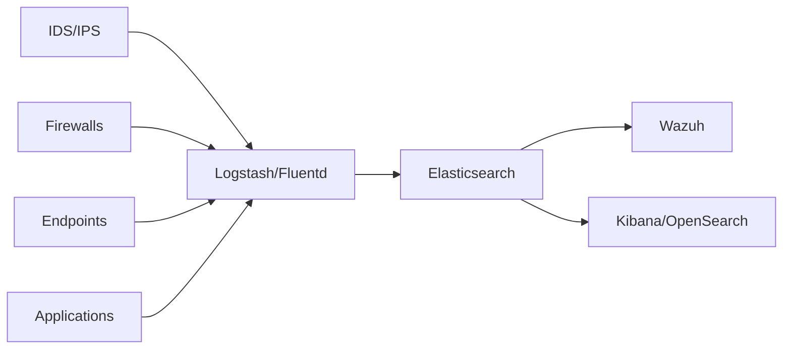

# Log Aggregation and Storage

The log aggregation layer serves as the central nervous system of the SOC architecture, collecting, processing, enriching, and storing security events from all sources for analysis and long-term retention.

<Info>
This layer uses industry-standard tools for building a scalable, high-performance log pipeline capable of handling millions of events per second.
</Info>

## Architecture Overview



<CardGroup cols={2}>
  <Card title="Log Processing" icon="filter">
    Logstash and Fluentd for data collection and transformation
  </Card>
  <Card title="Storage Engine" icon="database">
    Elasticsearch for scalable search and analytics
  </Card>
</CardGroup>

## Log Processing Pipeline

### Logstash

Logstash is a server-side data processing pipeline that ingests data from multiple sources:

<Tabs>
  <Tab title="Input Plugins">
    **Supported Input Sources:**
    - **Beats**: Lightweight shippers (Filebeat, Winlogbeat)
    - **Syslog**: RFC3164 and RFC5424 formats
    - **HTTP**: RESTful API endpoints
    - **TCP/UDP**: Raw network data
    - **File**: Direct file reading
    - **Kafka**: Distributed streaming platform
    - **JDBC**: Database connections
  </Tab>
  <Tab title="Filter Plugins">
    **Data Processing and Enrichment:**
    - **Grok**: Parse unstructured log data
    - **Mutate**: Modify, rename, remove fields
    - **GeoIP**: Add geographic information
    - **DNS**: Resolve IP addresses
    - **Date**: Parse timestamps
    - **User Agent**: Parse browser user agents
    - **Ruby**: Custom Ruby code execution
  </Tab>
  <Tab title="Output Plugins">
    **Destination Targets:**
    - **Elasticsearch**: Primary storage
    - **File**: Local or remote filesystem
    - **HTTP**: Webhook notifications
    - **Email**: Alert notifications
    - **Slack/PagerDuty**: Incident management
  </Tab>
</Tabs>

### Logstash Configuration Example

<Accordion title="IDS/IPS Alert Processing">
```ruby
input {
  # Receive Suricata EVE JSON logs
  file {
    path => "/var/log/suricata/eve.json"
    codec => json
    type => "suricata"
  }
  
  # Receive Snort alerts via syslog
  syslog {
    port => 5514
    type => "snort"
  }
}

filter {
  if [type] == "suricata" {
    # Extract source/destination info
    mutate {
      add_field => {
        "[source][ip]" => "%{[src_ip]}"
        "[destination][ip]" => "%{[dest_ip]}"
      }
    }
    
    # GeoIP enrichment
    geoip {
      source => "[source][ip]"
      target => "[source][geo]"
    }
    
    # Threat intelligence lookup
    if [alert][signature_id] {
      mutate {
        add_tag => ["ids_alert"]
      }
    }
  }
}

output {
  elasticsearch {
    hosts => ["elasticsearch:9200"]
    index => "soc-ids-%{+YYYY.MM.dd}"
    user => "logstash_writer"
    password => "${LOGSTASH_PASSWORD}"
  }
  
  # High severity alerts to Slack
  if [alert][severity] <= 2 {
    http {
      url => "https://hooks.slack.com/services/..."
      http_method => "post"
      format => "json"
    }
  }
}
```
</Accordion>

<Warning>
Always use environment variables or keystore for sensitive credentials. Never hardcode passwords in configuration files.
</Warning>

### Fluentd

Fluentd is a lightweight, Ruby-based log collector with a plugin ecosystem:

<AccordionGroup>
  <Accordion title="Why Use Fluentd?">
    **Advantages:**
    - Lower memory footprint than Logstash
    - Excellent for containerized environments
    - Native Kubernetes integration
    - Buffer and retry mechanisms
    - 500+ community plugins
  </Accordion>
  <Accordion title="Fluentd vs Logstash">
    **Use Fluentd when:**
    - Collecting logs from Kubernetes/Docker
    - Resource constraints are critical
    - Need lightweight forwarding agent
    
    **Use Logstash when:**
    - Complex data transformation required
    - Need extensive plugin ecosystem
    - Tight Elastic Stack integration preferred
  </Accordion>
</AccordionGroup>

### Fluentd Configuration Example

```ruby
# Collect Docker container logs
<source>
  @type forward
  port 24224
  bind 0.0.0.0
</source>

# Tail system logs
<source>
  @type tail
  path /var/log/auth.log
  pos_file /var/log/fluentd/auth.log.pos
  tag system.auth
  <parse>
    @type syslog
  </parse>
</source>

# Filter and enrich
<filter system.auth>
  @type record_transformer
  <record>
    hostname "#{Socket.gethostname}"
    environment "production"
  </record>
</filter>

# Output to Elasticsearch
<match **>
  @type elasticsearch
  host elasticsearch
  port 9200
  logstash_format true
  logstash_prefix soc-fluentd
  <buffer>
    @type file
    path /var/log/fluentd/buffer
    flush_interval 5s
    retry_max_times 3
  </buffer>
</match>
```

## Elasticsearch Storage

Elasticsearch serves as the primary storage and search engine for all security events.

### Core Capabilities

<CardGroup cols={2}>
  <Card title="Scalable Storage" icon="database">
    Distributed architecture scales horizontally across nodes
  </Card>
  <Card title="Fast Search" icon="magnifying-glass">
    Near real-time search across billions of documents
  </Card>
  <Card title="Aggregations" icon="chart-bar">
    Complex analytics and statistical operations
  </Card>
  <Card title="RESTful API" icon="code">
    JSON-based API for all operations
  </Card>
</CardGroup>

### Cluster Architecture

<Tabs>
  <Tab title="Node Types">
    **Specialized Node Roles:**
    
    - **Master Nodes**: Cluster state management (3 nodes for HA)
    - **Data Nodes**: Store indices and handle search queries
    - **Ingest Nodes**: Pre-processing pipeline execution
    - **Coordinating Nodes**: Route requests, merge results
  </Tab>
  <Tab title="Index Management">
    **Index Organization:**
    
    - Time-based indices (daily, weekly)
    - Index templates for consistency
    - Index lifecycle management (ILM)
    - Rollover and snapshot policies
  </Tab>
  <Tab title="High Availability">
    **Resilience Features:**
    
    - Shard replication (1-2 replicas)
    - Cross-cluster replication
    - Snapshot and restore
    - Automatic failover
  </Tab>
</Tabs>

### Index Templates

<Tip>
Use index templates to ensure consistent field mappings across all time-based indices. This prevents mapping conflicts and enables better query performance.
</Tip>

```json
// SOC index template
PUT _index_template/soc-logs
{
  "index_patterns": ["soc-*"],
  "template": {
    "settings": {
      "number_of_shards": 3,
      "number_of_replicas": 1,
      "index.codec": "best_compression",
      "refresh_interval": "5s"
    },
    "mappings": {
      "properties": {
        "@timestamp": {"type": "date"},
        "source.ip": {"type": "ip"},
        "destination.ip": {"type": "ip"},
        "event.severity": {"type": "integer"},
        "message": {
          "type": "text",
          "fields": {
            "keyword": {"type": "keyword"}
          }
        },
        "threat.indicator.ip": {"type": "ip"},
        "geo.location": {"type": "geo_point"}
      }
    }
  },
  "priority": 500
}
```

### Data Retention and Lifecycle

<AccordionGroup>
  <Accordion title="Index Lifecycle Policies (ILM)">
    Automate index management through lifecycle phases:
    
    **Hot Phase** (0-7 days):
    - Actively written and queried
    - High-performance SSD storage
    - Full replicas for availability
    
    **Warm Phase** (7-30 days):
    - Read-only, infrequent queries
    - Reduce replica count
    - Force merge to fewer segments
    
    **Cold Phase** (30-90 days):
    - Rarely accessed
    - Move to cheaper storage
    - Minimum replicas
    
    **Delete Phase** (>90 days):
    - Automatically delete old indices
    - Or snapshot to long-term storage
  </Accordion>
  <Accordion title="ILM Configuration Example">
    ```json
    PUT _ilm/policy/soc-policy
    {
      "policy": {
        "phases": {
          "hot": {
            "actions": {
              "rollover": {
                "max_age": "7d",
                "max_size": "50gb"
              }
            }
          },
          "warm": {
            "min_age": "7d",
            "actions": {
              "shrink": {"number_of_shards": 1},
              "forcemerge": {"max_num_segments": 1}
            }
          },
          "cold": {
            "min_age": "30d",
            "actions": {
              "freeze": {}
            }
          },
          "delete": {
            "min_age": "90d",
            "actions": {
              "delete": {}
            }
          }
        }
      }
    }
    ```
  </Accordion>
</AccordionGroup>

## Data Processing Patterns

### Parsing and Normalization

Standardize log formats across different sources:

<Tabs>
  <Tab title="Grok Patterns">
    Parse unstructured logs with Grok:
    ```ruby
    # Apache access log parsing
    filter {
      grok {
        match => {
          "message" => "%{COMBINEDAPACHELOG}"
        }
      }
      
      # Parse custom application logs
      grok {
        match => {
          "message" => "%{TIMESTAMP_ISO8601:timestamp} \[%{LOGLEVEL:level}\] %{GREEDYDATA:msg}"
        }
      }
    }
    ```
  </Tab>
  <Tab title="Field Extraction">
    Extract specific fields:
    ```ruby
    filter {
      # Extract username from message
      grok {
        match => {
          "message" => "User %{USERNAME:user} logged in from %{IP:source_ip}"
        }
      }
      
      # Convert fields to appropriate types
      mutate {
        convert => {
          "response_time" => "integer"
          "bytes_sent" => "integer"
        }
      }
    }
    ```
  </Tab>
  <Tab title="Enrichment">
    Add contextual information:
    ```ruby
    filter {
      # GeoIP enrichment
      geoip {
        source => "source_ip"
        target => "source_geo"
        fields => ["city_name", "country_name", "location"]
      }
      
      # DNS resolution
      dns {
        reverse => ["source_ip"]
        action => "replace"
        nameserver => ["8.8.8.8"]
      }
      
      # Add custom metadata
      mutate {
        add_field => {
          "environment" => "production"
          "data_center" => "dc-01"
        }
      }
    }
    ```
  </Tab>
</Tabs>

### Performance Optimization

<Warning>
Inefficient log processing can create bottlenecks. Monitor pipeline performance and optimize configurations for high-volume environments.
</Warning>

<CardGroup cols={2}>
  <Card title="Logstash Tuning" icon="gauge-high">
    - Increase pipeline workers
    - Adjust batch size and delay
    - Use persistent queues
    - Enable pipeline monitoring
  </Card>
  <Card title="Elasticsearch Tuning" icon="server">
    - Optimize JVM heap size (50% of RAM, max 32GB)
    - Use SSD storage for hot data
    - Tune thread pools
    - Configure circuit breakers
  </Card>
</CardGroup>

### Monitoring Pipeline Health

```bash
# Logstash pipeline stats
curl -XGET 'localhost:9600/_node/stats/pipelines?pretty'

# Elasticsearch cluster health
curl -XGET 'localhost:9200/_cluster/health?pretty'

# Index statistics
curl -XGET 'localhost:9200/_cat/indices/soc-*?v&s=index'

# Node statistics
curl -XGET 'localhost:9200/_nodes/stats?pretty'
```

## Integration with SOC Components

### Data Flow

1. **Collection**: Logstash/Fluentd collect from multiple sources
2. **Processing**: Parse, enrich, and normalize events
3. **Storage**: Write to Elasticsearch indices
4. **Analysis**: Wazuh queries Elasticsearch for correlation
5. **Visualization**: Dashboards display aggregated data

### Source Integration Examples

<Tabs>
  <Tab title="IDS/IPS Integration">
    ```ruby
    # Suricata EVE JSON
    input {
      file {
        path => "/var/log/suricata/eve.json"
        codec => json
        type => "suricata"
      }
    }
    
    filter {
      if [event_type] == "alert" {
        mutate {
          add_field => { "[event][category]" => "intrusion_detection" }
          add_tag => ["ids", "security"]
        }
      }
    }
    ```
  </Tab>
  <Tab title="Firewall Logs">
    ```ruby
    # OPNsense/pfSense logs
    input {
      syslog {
        port => 5140
        type => "firewall"
      }
    }
    
    filter {
      grok {
        match => {
          "message" => "%{SYSLOGTIMESTAMP} %{WORD:action} %{WORD:protocol} %{IP:src_ip}:%{INT:src_port} -> %{IP:dst_ip}:%{INT:dst_port}"
        }
      }
    }
    ```
  </Tab>
  <Tab title="Wazuh Agents">
    ```ruby
    # Wazuh agent logs
    input {
      tcp {
        port => 1514
        codec => json
        type => "wazuh"
      }
    }
    
    filter {
      if [rule][level] >= 10 {
        mutate {
          add_tag => ["critical", "alert"]
        }
      }
    }
    ```
  </Tab>
</Tabs>

## Best Practices

<AccordionGroup>
  <Accordion title="Data Collection">
    - Use buffering to handle traffic spikes
    - Implement input rate limiting
    - Tag data at ingestion point
    - Validate data format before processing
  </Accordion>
  <Accordion title="Processing">
    - Keep filters simple and efficient
    - Use conditionals to avoid unnecessary processing
    - Test Grok patterns before production
    - Monitor filter execution time
  </Accordion>
  <Accordion title="Storage">
    - Implement time-based indices
    - Use appropriate shard sizes (20-40GB)
    - Enable compression for cold data
    - Regular snapshot backups
  </Accordion>
  <Accordion title="Security">
    - Enable TLS for all communications
    - Implement role-based access control
    - Audit log access and modifications
    - Encrypt data at rest
  </Accordion>
</AccordionGroup>

## Official Documentation

<CardGroup cols={2}>
  <Card title="Logstash Guide" icon="book" href="https://www.elastic.co/guide/en/logstash/current/index.html">
    Complete Logstash documentation and plugin reference
  </Card>
  <Card title="Fluentd Documentation" icon="book" href="https://docs.fluentd.org/">
    Fluentd installation, configuration, and plugins
  </Card>
  <Card title="Elasticsearch Guide" icon="book" href="https://www.elastic.co/guide/en/elasticsearch/reference/current/index.html">
    Comprehensive Elasticsearch documentation
  </Card>
  <Card title="Elastic Common Schema" icon="diagram-project" href="https://www.elastic.co/guide/en/ecs/current/index.html">
    ECS field naming conventions for normalization
  </Card>
</CardGroup>

## Next Steps

1. Configure [SIEM Platform](/components/siem-platform) to query Elasticsearch indices
2. Set up [Detection Layer](/components/detection-layer) log forwarding
3. Implement [Infrastructure Monitoring](/components/infrastructure-monitoring) integration