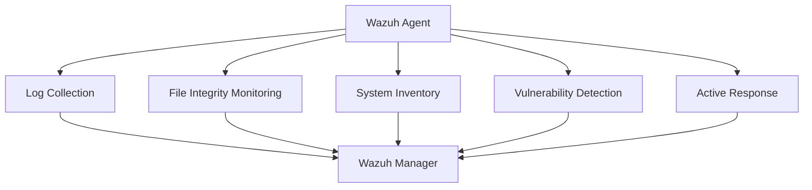

# SIEM Platform - Wazuh

Wazuh serves as the central security platform in the SOC architecture, providing comprehensive SIEM (Security Information and Event Management) and XDR (Extended Detection and Response) capabilities with built-in EDR (Endpoint Detection and Response) functionality.

<Info>
Wazuh is a free, open-source security platform that unifies XDR and SIEM capabilities, providing visibility across endpoints, cloud workloads, network devices, and containers.
</Info>

## Platform Overview

<CardGroup cols={2}>
  <Card title="SIEM Capabilities" icon="chart-line">
    Event correlation, log analysis, and security monitoring
  </Card>
  <Card title="XDR Features" icon="layer-group">
    Extended detection across endpoints, network, and cloud
  </Card>
  <Card title="EDR Integration" icon="laptop">
    Endpoint detection, response, and threat hunting
  </Card>
  <Card title="Compliance" icon="file-shield">
    PCI DSS, GDPR, HIPAA, NIST 800-53 compliance monitoring
  </Card>
</CardGroup>

## Core Capabilities

### Security Event Visualization

Wazuh provides comprehensive dashboards and visualization capabilities:

<Tabs>
  <Tab title="Overview Dashboard">
    - Security events summary
    - Alert severity distribution
    - Top triggered rules
    - Geographic threat map
    - Agent status overview
  </Tab>
  <Tab title="Threat Detection">
    - Real-time threat alerts
    - MITRE ATT&CK framework mapping
    - Threat intelligence integration
    - Vulnerability detection
    - File integrity monitoring alerts
  </Tab>
  <Tab title="Compliance">
    - Regulatory compliance status
    - Policy violation tracking
    - Audit report generation
    - Configuration assessment
  </Tab>
</Tabs>

<Note>
Wazuh dashboards are built on OpenSearch Dashboards (formerly Kibana), providing powerful visualization and search capabilities across all security data.
</Note>

### Event Correlation Engine

The correlation engine enables sophisticated threat detection:

<AccordionGroup>
  <Accordion title="Rule-based Correlation">
    Correlate events using flexible rule syntax:
    - Multi-stage attack detection
    - Frequency-based alerting
    - Time-window correlation
    - Cross-source event matching
  </Accordion>
  <Accordion title="Automatic Response">
    Trigger automated responses to threats:
    - Block malicious IPs at firewall
    - Disable compromised accounts
    - Isolate infected endpoints
    - Execute custom scripts
  </Accordion>
  <Accordion title="Threat Intelligence">
    Enrich events with threat intelligence:
    - IP reputation lookups
    - File hash verification
    - Domain reputation checking
    - CVE database integration
  </Accordion>
</AccordionGroup>

## EDR (Endpoint Detection and Response)

### Agent Capabilities

Wazuh agents provide comprehensive endpoint visibility:



<Tabs>
  <Tab title="Monitoring Features">
    **Continuous Monitoring:**
    - Log collection and forwarding
    - Command execution monitoring
    - Process creation tracking
    - Network connection monitoring
    - Registry changes (Windows)
    - File system activity
  </Tab>
  <Tab title="Detection Capabilities">
    **Threat Detection:**
    - Malware detection
    - Rootkit detection
    - Anomalous behavior identification
    - Privilege escalation attempts
    - Suspicious process execution
    - Lateral movement detection
  </Tab>
  <Tab title="Response Actions">
    **Active Response:**
    - Firewall rule modification
    - Process termination
    - Account lockout
    - Network isolation
    - Custom script execution
  </Tab>
</Tabs>

### File Integrity Monitoring (FIM)

<Warning>
FIM generates significant events for high-change directories. Carefully select monitored paths to balance security visibility with system performance.
</Warning>

Monitor critical system files and directories:

```xml
<!-- Wazuh FIM configuration example -->
<syscheck>
  <directories check_all="yes" realtime="yes">/etc</directories>
  <directories check_all="yes" realtime="yes">/usr/bin</directories>
  <directories check_all="yes" realtime="yes">/usr/sbin</directories>
  
  <!-- Windows critical paths -->
  <directories check_all="yes" realtime="yes">C:\Windows\System32</directories>
  <directories check_all="yes" realtime="yes">C:\Program Files</directories>
  
  <ignore type="sregex">\.log$|/tmp</ignore>
</syscheck>
```

## Architecture Components

### Wazuh Manager

The central management server that:

- **Receives** agent data and external log sources
- **Processes** events through the analysis engine
- **Correlates** events across multiple sources
- **Stores** alerts in Elasticsearch/OpenSearch
- **Manages** agent configurations and policies

<Tip>
Deploy Wazuh Manager in a cluster configuration for high availability and load distribution in enterprise environments.
</Tip>

### Wazuh Indexer

Based on OpenSearch, provides:

- **Storage**: Scalable alert and event storage
- **Search**: Full-text search across all security data
- **Aggregation**: Complex data aggregations for analytics
- **Retention**: Configurable data retention policies

### Wazuh Dashboard

Web-based interface offering:

- **Visualization**: Pre-built and custom dashboards
- **Investigation**: Advanced search and filtering
- **Reporting**: Automated report generation
- **Management**: Agent and configuration management
- **API Access**: RESTful API for automation

## Integration Points

### Data Sources

Wazuh ingests data from multiple sources:

<CardGroup cols={2}>
  <Card title="Network Detection" icon="network-wired">
    - Snort/Suricata alerts via syslog
    - Firewall logs (OPNsense, pfSense)
    - Network device syslogs
  </Card>
  <Card title="Log Aggregation" icon="database">
    - Elasticsearch indices
    - Logstash pipelines
    - Fluentd forwarding
  </Card>
  <Card title="Infrastructure" icon="server">
    - Zabbix alerts
    - Prometheus metrics
    - System logs
  </Card>
  <Card title="Cloud Platforms" icon="cloud">
    - AWS CloudTrail
    - Azure Activity Logs
    - Google Cloud Audit Logs
  </Card>
</CardGroup>

### Integration Configuration

<Tabs>
  <Tab title="Syslog Integration">
    Configure remote syslog reception:
    ```xml
    <remote>
      <connection>syslog</connection>
      <port>514</port>
      <protocol>udp</protocol>
      <allowed-ips>10.0.0.0/8</allowed-ips>
    </remote>
    ```
  </Tab>
  <Tab title="API Integration">
    Use Wazuh API for automation:
    ```bash
    # Authenticate and get token
    curl -u user:password -X POST \
      "https://wazuh-manager:55000/security/user/authenticate"
    
    # Get agent list
    curl -X GET "https://wazuh-manager:55000/agents" \
      -H "Authorization: Bearer $TOKEN"
    ```
  </Tab>
  <Tab title="Webhook Alerts">
    Forward alerts to external systems:
    ```xml
    <integration>
      <name>slack</name>
      <hook_url>https://hooks.slack.com/services/...</hook_url>
      <level>10</level>
      <alert_format>json</alert_format>
    </integration>
    ```
  </Tab>
</Tabs>

## Customizable Dashboards

### Pre-built Dashboards

Wazuh includes dashboards for:

- **Security Events**: Overview of all security alerts
- **Integrity Monitoring**: FIM changes and anomalies
- **Vulnerability Detection**: CVE findings across endpoints
- **Regulatory Compliance**: PCI DSS, GDPR, HIPAA status
- **MITRE ATT&CK**: Attacks mapped to framework
- **Threat Hunting**: Advanced search interface

### Custom Dashboard Creation

<Accordion title="Creating Custom Visualizations">
  1. Navigate to Dashboard management
  2. Select data source (wazuh-alerts-*)
  3. Choose visualization type (bar, pie, map, etc.)
  4. Configure aggregations and filters
  5. Save and add to dashboard
</Accordion>

<Accordion title="Dashboard Best Practices">
  - Focus on actionable metrics
  - Use appropriate time ranges
  - Implement drill-down capabilities
  - Set auto-refresh intervals
  - Export dashboards for backup
</Accordion>

## Threat Detection and Hunting

### Detection Rules

Wazuh includes 3000+ out-of-the-box rules:

<Tabs>
  <Tab title="Rule Categories">
    - Authentication failures
    - Web application attacks
    - Malware detection
    - System configuration changes
    - Network anomalies
    - Compliance violations
  </Tab>
  <Tab title="Custom Rules">
    Create custom detection rules:
    ```xml
    <rule id="100001" level="10">
      <if_group>authentication_failed</if_group>
      <match>authentication failure</match>
      <same_source_ip />
      <frequency>5</frequency>
      <timeframe>120</timeframe>
      <description>Multiple authentication failures</description>
    </rule>
    ```
  </Tab>
  <Tab title="Rule Testing">
    Test rules before deployment:
    ```bash
    # Test rule syntax
    /var/ossec/bin/wazuh-logtest
    
    # Input sample log
    # View matched rules and alert level
    ```
  </Tab>
</Tabs>

### Threat Hunting

<Tip>
Use Wazuh's query language to hunt for specific indicators of compromise across your entire environment in real-time.
</Tip>

Advanced search capabilities:

```javascript
// Hunt for PowerShell execution with encoded commands
data.win.eventdata.commandLine:*-enc* AND rule.id:61603

// Find lateral movement attempts
rule.mitre.tactic:"Lateral Movement" AND agent.ip:10.0.0.0/8

// Search for specific file hashes
data.virustotal.malicious:>0 AND data.sha256:"abc123..."
```

## Configuration Management

### Centralized Configuration

Manage agent configurations from the central server:

<AccordionGroup>
  <Accordion title="Agent Groups">
    Organize agents into logical groups:
    - **Linux Servers**: Linux-specific monitoring
    - **Windows Workstations**: Windows policy enforcement
    - **Web Servers**: Application-specific rules
    - **Database Servers**: Database security monitoring
  </Accordion>
  <Accordion title="Policy Distribution">
    Push configurations to agent groups:
    ```xml
    <!-- agent.conf for web servers group -->
    <agent_config name="web_servers">
      <localfile>
        <log_format>apache</log_format>
        <location>/var/log/apache2/access.log</location>
      </localfile>
      <rootcheck>
        <frequency>86400</frequency>
      </rootcheck>
    </agent_config>
    ```
  </Accordion>
</AccordionGroup>

## Performance Tuning

<Warning>
In high-volume environments, proper tuning is essential to prevent event loss and ensure timely alert processing.
</Warning>

### Optimization Strategies

- **Indexer Tuning**: Adjust heap size, shards, and replicas
- **Manager Scaling**: Distribute load across cluster nodes
- **Agent Throttling**: Limit events per second per agent
- **Rule Optimization**: Disable unnecessary rules
- **Data Retention**: Implement lifecycle policies for old indices

## Compliance Monitoring

Automatic compliance checking for:

<CardGroup cols={2}>
  <Card title="PCI DSS" icon="credit-card">
    Payment card industry security standards
  </Card>
  <Card title="GDPR" icon="shield-halved">
    General data protection regulation
  </Card>
  <Card title="HIPAA" icon="notes-medical">
    Healthcare information security
  </Card>
  <Card title="NIST 800-53" icon="file-shield">
    Federal security controls
  </Card>
</CardGroup>

## Official Documentation

<Card title="Wazuh Documentation" icon="book" href="https://documentation.wazuh.com/">
  Comprehensive official documentation covering installation, configuration, and use cases
</Card>

## Next Steps

1. Configure [Incident Response](/components/incident-response) integration with TheHive
2. Set up [Automation](/components/automation-soar) with Cortex for response actions
3. Review [Threat Detection](/security/threat-detection) strategies and hunting techniques