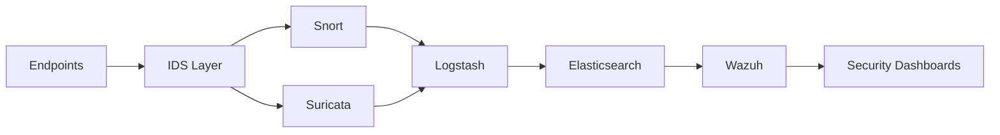
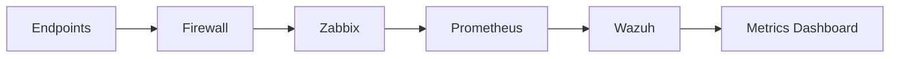
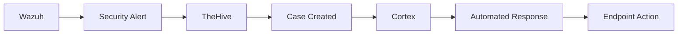
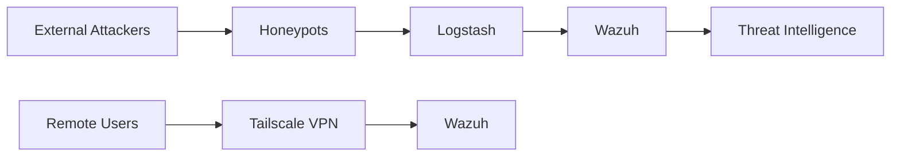
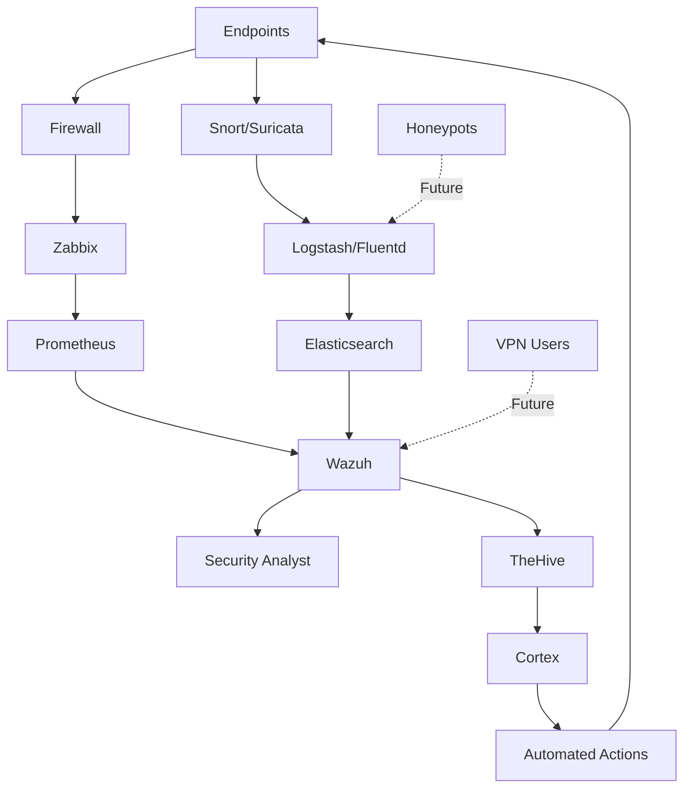

Understanding the data flow is critical to comprehending how the SOC Architecture detects, processes, analyzes, and responds to security events. This page details the complete data pipeline from endpoints to automated response.

## Overview

The SOC Architecture implements a multi-layered data flow that ensures comprehensive visibility, efficient processing, and rapid response to security events.

<Note type="info">
  All data flows are designed to be **bidirectional** where necessary, allowing for feedback loops and automated responses.
</Note>

## Primary Data Flow Paths

### 1. Network Traffic Detection Flow

<CardGroup cols={1}>
  <Card title="Network Traffic Detection Pipeline" icon="network-wired">
    **Flow**: Endpoints → IDS (Snort/Suricata) → Logstash → Elasticsearch → Wazuh
    
    1. **Endpoints** generate network traffic
    2. **IDS Systems** (Snort/Suricata) monitor all traffic for suspicious patterns
    3. **Logstash** collects and processes IDS alerts and logs
    4. **Elasticsearch** stores processed events for analysis
    5. **Wazuh** correlates events and displays security insights
  </Card>
</CardGroup>

### 2. Infrastructure Monitoring Flow

<CardGroup cols={1}>
  <Card title="Infrastructure & Performance Monitoring Pipeline" icon="server">
    **Flow**: Endpoints → Firewall → Zabbix → Prometheus → Wazuh
    
    1. **Endpoints** send traffic through the firewall
    2. **Firewall** provides network metrics and connection data
    3. **Zabbix** monitors infrastructure availability and performance
    4. **Prometheus** collects real-time metrics and generates alerts
    5. **Wazuh** aggregates monitoring data with security events
  </Card>
</CardGroup>

### 3. Incident Response Flow

<CardGroup cols={1}>
  <Card title="Incident Management & Response Pipeline" icon="bell">
    **Flow**: Wazuh → TheHive → Cortex → Automated Response
    
    1. **Wazuh** detects security event and triggers alert
    2. **TheHive** creates incident case for investigation
    3. **Cortex** analyzes the incident and determines response
    4. **Automated Response** executes predefined playbooks
    5. **Actions** applied to affected endpoints or infrastructure
  </Card>
</CardGroup>

### 4. Future: Honeypot & VPN Flow

<Note type="warning">
  This data flow is planned for **long-term implementation** and represents future capabilities.
</Note>

<CardGroup cols={1}>
  <Card title="Deception & Secure Access Pipeline (Long-term)" icon="road">
    **Flow**: Honeypots/VPN → Logstash/Wazuh → Analysis
    
    1. **Honeypots** attract and log attacker activities
    2. **Tailscale VPN** provides secure remote access with logging
    3. **Logstash** processes honeypot and VPN logs
    4. **Wazuh** correlates deception data with other security events
    5. **Threat Intelligence** is enriched with real attack patterns
  </Card>
</CardGroup>

## Event Processing Pipeline

<Accordion title="Stage 1: Collection">
  **Data Sources**:
  - Network traffic (via IDS/IPS)
  - Endpoint logs (via Wazuh agents)
  - Firewall logs
  - Infrastructure metrics (Zabbix, Prometheus)
  - Application logs
  
  **Technologies**: Snort, Suricata, Wazuh Agents, Zabbix, Prometheus
</Accordion>

<Accordion title="Stage 2: Aggregation & Normalization">
  **Processing**:
  - Log collection from multiple sources
  - Data format normalization
  - Field extraction and enrichment
  - Initial filtering and routing
  
  **Technologies**: Logstash, Fluentd
</Accordion>

<Accordion title="Stage 3: Storage & Indexing">
  **Storage**:
  - Indexed storage for fast search
  - Long-term retention
  - Data compression
  - Backup and archival
  
  **Technologies**: Elasticsearch
</Accordion>

<Accordion title="Stage 4: Analysis & Correlation">
  **Analysis**:
  - Event correlation across sources
  - Pattern matching and anomaly detection
  - Threat intelligence integration
  - Risk scoring
  
  **Technologies**: Wazuh (SIEM/XDR)
</Accordion>

<Accordion title="Stage 5: Alerting & Visualization">
  **Presentation**:
  - Security dashboards
  - Real-time alerts
  - Compliance reporting
  - Custom visualizations
  
  **Technologies**: Wazuh Dashboard, Prometheus, Zabbix
</Accordion>

<Accordion title="Stage 6: Response & Remediation">
  **Response**:
  - Incident case creation
  - Automated playbook execution
  - Endpoint isolation or remediation
  - Notification workflows
  
  **Technologies**: TheHive, Cortex
</Accordion>

## Data Flow Characteristics

### Latency Expectations

| Flow Path | Expected Latency | Priority |
|-----------|------------------|----------|
| IDS → Wazuh | < 5 seconds | High |
| Metrics → Prometheus | < 10 seconds | Medium |
| Alert → TheHive | < 30 seconds | High |
| Cortex Response | < 2 minutes | Critical |

### Data Volume Planning

<Note type="tip">
  Elasticsearch sizing should account for:
  - **Log ingestion rate**: 10,000-50,000 events/second (estimated)
  - **Retention period**: 90 days (hot), 1 year (warm)
  - **Replication factor**: 2x for high availability
</Note>

## Integration Points

For detailed information about how specific components integrate with each other, see the [Integrations](/reference/integrations) page.

## Complete Flow Diagram

<Note type="info">
  Dotted lines represent **long-term planned** data flows that are not part of the initial core architecture.
</Note>