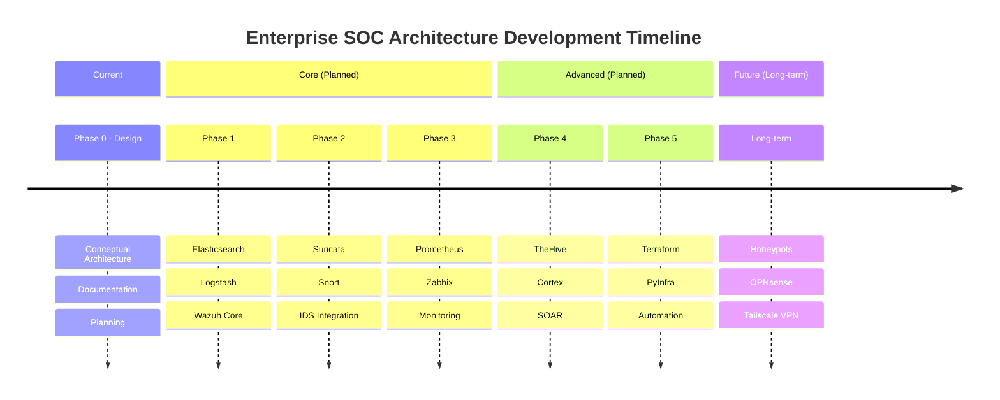

## Current Project Status

<Note type="warning">
  **Conceptual Design Phase**: This project is currently in the conceptual design and planning stage. No implementation has begun. All components, architecture, and workflows are subject to change based on project requirements.
</Note>

<CardGroup cols={3}>
  <Card title="Phase" icon="compass">
    **Conceptual Design**
    
    Planning and architecture definition
  </Card>
  
  <Card title="Status" icon="circle-info">
    **Not Implemented**
    
    No deployment or configuration started
  </Card>
  
  <Card title="Timeline" icon="calendar">
    **To Be Determined**
    
    Implementation timeline not yet defined
  </Card>
</CardGroup>

## Development Phases

<Steps>
  <Step title="Phase 0: Conceptual Design (Current)">
    **Objective**: Define complete SOC architecture and components
    
    **Activities**:
    - Architecture design and documentation
    - Technology stack evaluation
    - Data flow planning
    - Integration requirements analysis
    - Resource and infrastructure planning
    
    **Status**: **In Progress**
    
    **Deliverables**:
    - Complete architecture diagram
    - Component specifications
    - Data flow documentation
    - Integration design
  </Step>
  
  <Step title="Phase 1: Core Infrastructure (Planned)">
    **Objective**: Deploy foundational monitoring and logging infrastructure
    
    **Components**:
    - Elasticsearch cluster setup
    - Logstash/Fluentd pipeline configuration
    - Wazuh manager and dashboard deployment
    - Basic Wazuh agent deployment on endpoints
    
    **Prerequisites**:
    - Infrastructure provisioning (servers, storage, network)
    - Base OS installation and hardening
    - Network segmentation implementation
    
    **Estimated Duration**: To Be Determined
    
    **Success Criteria**:
    - Centralized log collection operational
    - Wazuh dashboard accessible
    - Basic security event visibility
  </Step>
  
  <Step title="Phase 2: Detection Layer (Planned)">
    **Objective**: Implement network intrusion detection capabilities
    
    **Components**:
    - Suricata IDS/IPS deployment
    - Snort IDS configuration (alternative/complementary)
    - Network tap/mirror configuration
    - Integration with Logstash pipeline
    - Rule tuning and baseline establishment
    
    **Dependencies**: Phase 1 completion
    
    **Estimated Duration**: To Be Determined
    
    **Success Criteria**:
    - IDS actively monitoring network traffic
    - Alerts flowing to Wazuh
    - False positive rate < 5%
  </Step>
  
  <Step title="Phase 3: Monitoring & Metrics (Planned)">
    **Objective**: Add infrastructure monitoring and performance metrics
    
    **Components**:
    - Prometheus deployment and configuration
    - Zabbix server and agent setup
    - Integration with Wazuh platform
    - Dashboard creation for unified visibility
    - Alert threshold configuration
    
    **Dependencies**: Phase 1 completion
    
    **Estimated Duration**: To Be Determined
    
    **Success Criteria**:
    - All critical infrastructure monitored
    - Availability metrics > 99%
    - Performance baselines established
  </Step>
  
  <Step title="Phase 4: Incident Response (Planned)">
    **Objective**: Implement incident management and automated response
    
    **Components**:
    - TheHive platform deployment
    - Cortex SOAR setup and analyzer configuration
    - Integration with Wazuh alerting
    - Response playbook development
    - Team training on incident workflow
    
    **Dependencies**: Phases 1-3 completion
    
    **Estimated Duration**: To Be Determined
    
    **Success Criteria**:
    - Automated case creation from alerts
    - 3+ response playbooks operational
    - Mean time to response < 15 minutes
  </Step>
  
  <Step title="Phase 5: Automation & IaC (Planned)">
    **Objective**: Implement infrastructure as code and automation
    
    **Components**:
    - Terraform modules for infrastructure
    - PyInfra scripts for configuration management
    - CI/CD pipeline for SOC infrastructure
    - Automated deployment and rollback procedures
    
    **Dependencies**: Phases 1-4 completion
    
    **Estimated Duration**: To Be Determined
    
    **Success Criteria**:
    - Complete infrastructure defined as code
    - Automated deployment tested
    - Rollback capability verified
  </Step>
</Steps>

## Long-Term Roadmap

<Note type="info">
  The following components are planned for **long-term implementation** after the core SOC architecture is operational and stable.
</Note>

### Advanced Security Capabilities

<Accordion title="Honeypots-Proxmox (Long-term)">
  **Purpose**: Deception technology to attract and analyze attackers
  
  **Implementation Plan**:
  - Deploy Proxmox virtualization cluster
  - Create honeypot VM templates (SSH, HTTP, SMB services)
  - Configure network isolation and monitoring
  - Integrate honeypot logs with Wazuh
  - Develop threat intelligence pipeline
  
  **Timeline**: After Phase 5 completion + 6 months
  
  **Requirements**:
  - Dedicated hardware for Proxmox cluster
  - Isolated network segment
  - Automated threat analysis tools
  
  **Success Metrics**:
  - Capture real attack patterns
  - Generate actionable threat intelligence
  - Zero honeypot compromise of production systems
</Accordion>

<Accordion title="OPNsense Firewall (Long-term)">
  **Purpose**: Advanced perimeter security and network segmentation
  
  **Implementation Plan**:
  - Deploy OPNsense on dedicated hardware or VM
  - Configure network zones and VLANs
  - Implement firewall rules and IPS
  - Set up VPN capabilities
  - Integrate with central logging
  
  **Timeline**: After Phase 4 completion + 3 months
  
  **Requirements**:
  - High-availability hardware pair
  - Network reconfiguration for segmentation
  - Failover testing
  
  **Success Metrics**:
  - Zero unplanned outages
  - Effective network segmentation
  - Centralized firewall rule management
</Accordion>

<Accordion title="Tailscale VPN (Long-term)">
  **Purpose**: Secure remote access to SOC infrastructure
  
  **Implementation Plan**:
  - Deploy Tailscale control plane
  - Configure access control policies
  - Enroll SOC administrators and analysts
  - Integrate with identity provider (SAML/OIDC)
  - Enable audit logging to Wazuh
  
  **Timeline**: After Phase 3 completion + 2 months
  
  **Requirements**:
  - Identity provider integration
  - Multi-factor authentication
  - Endpoint compliance checking
  
  **Success Metrics**:
  - Secure remote access for all team members
  - Complete audit trail of VPN access
  - Zero unauthorized access incidents
</Accordion>

## Roadmap Visualization

## Key Milestones

| Milestone | Phase | Target | Status |
|-----------|-------|--------|--------|
| Architecture Design Complete | 0 | Q1 2026 | In Progress |
| Core Logging Operational | 1 | To Be Determined | Not Started |
| IDS Detection Active | 2 | To Be Determined | Not Started |
| Monitoring Dashboard Live | 3 | To Be Determined | Not Started |
| First Automated Response | 4 | To Be Determined | Not Started |
| Infrastructure as Code | 5 | To Be Determined | Not Started |
| Honeypot Deployment | Long-term | To Be Determined | Not Started |
| VPN Access Enabled | Long-term | To Be Determined | Not Started |

## Considerations & Constraints

<CardGroup cols={2}>
  <Card title="Scalability" icon="chart-line">
    - Design supports gradual growth
    - Modular architecture allows phased implementation
    - Components can scale independently
  </Card>
  
  <Card title="Flexibility" icon="rotate">
    - Architecture is adaptable to changing requirements
    - Component substitution possible
    - Open standards and protocols preferred
  </Card>
  
  <Card title="Resource Requirements" icon="server">
    - Significant hardware and infrastructure needed
    - Dedicated team for implementation and operations
    - Ongoing maintenance and tuning required
  </Card>
  
  <Card title="Risk Management" icon="shield">
    - Pilot testing before production deployment
    - Rollback procedures for all changes
    - High availability for critical components
  </Card>
</CardGroup>

## Next Steps

<Note type="tip">
  **Immediate Actions**:
  1. Finalize architecture documentation
  2. Define detailed requirements for Phase 1
  3. Secure budget and resources
  4. Establish implementation team
  5. Create detailed project timeline
  6. Begin vendor/solution evaluation
</Note>

## Contributing to the Roadmap

This roadmap is a living document and will evolve based on:
- Organizational security requirements
- Technology advancements
- Threat landscape changes
- Resource availability
- Lessons learned during implementation

Feedback and suggestions for roadmap improvements are welcome during the planning phase.